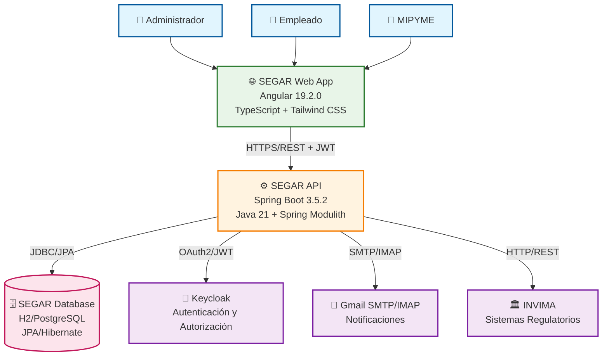
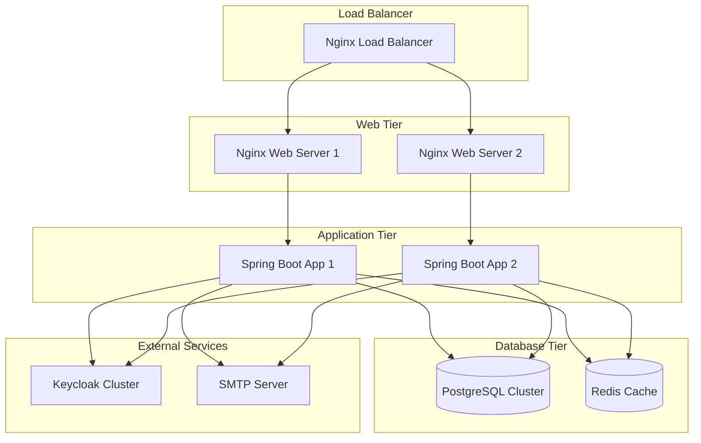
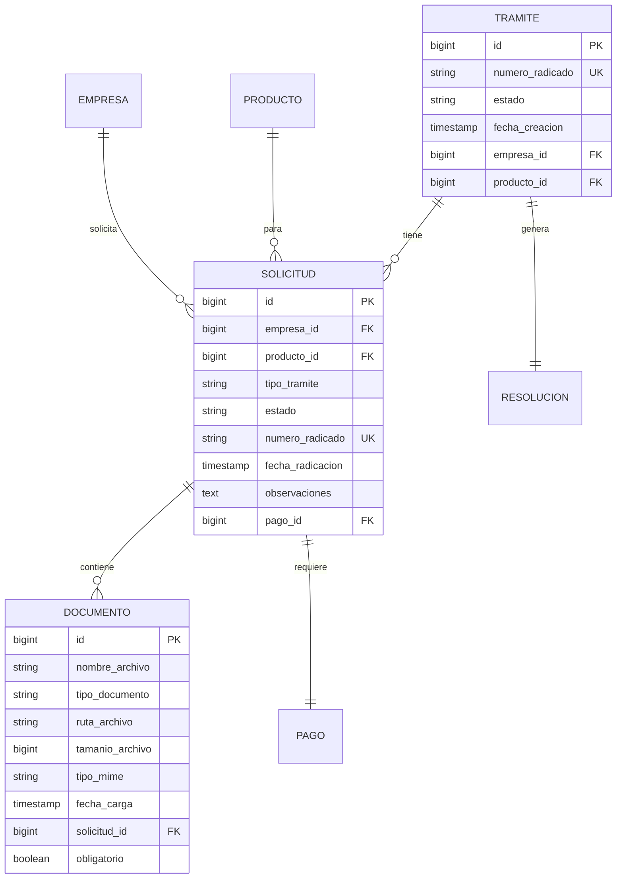

# 📋 Documentación Completa del Proyecto SEGAR
## Sistema de Gestión de Trámites Regulatorios

**Última actualización**: Noviembre 11, 2025  
**Versión del Sistema**: 1.2.0  
**Estado**: En Desarrollo Activo

---

## 📑 Tabla de Contenidos

1. [Introducción al Proyecto](#introducción-al-proyecto)
2. [Arquitectura del Sistema](#arquitectura-del-sistema)
3. [Backend - Spring Boot](#backend---spring-boot)
4. [Frontend - Angular](#frontend---angular)
5. [Base de Datos](#base-de-datos)
6. [Autenticación y Seguridad](#autenticación-y-seguridad)
7. [Módulos y Funcionalidades](#módulos-y-funcionalidades)
8. [Sistema de Notificaciones y Correo](#sistema-de-notificaciones-y-correo)
9. [Gestión de Usuarios con Keycloak](#gestión-de-usuarios-con-keycloak)
10. [Configuración y Despliegue](#configuración-y-despliegue)
11. [Guías de Desarrollo](#guías-de-desarrollo)
12. [Testing y Calidad](#testing-y-calidad)
13. [Documentación Técnica](#documentación-técnica)
14. [Roadmap y Futuras Mejoras](#roadmap-y-futuras-mejoras)

---

## Introducción al Proyecto

### 🎯 Propósito

SEGAR (Sistema de Gestión de Trámites Regulatorios) es una aplicación web diseñada para automatizar la gestión de trámites regulatorios en el sector de alimentos procesados en Colombia. El sistema está orientado principalmente a las micro, pequeñas y medianas empresas (MIPYMES) del sector alimentario.

### 🏢 Contexto del Negocio

Las empresas del sector de alimentos procesados en Colombia enfrentan desafíos significativos en la gestión de trámites regulatorios ante el INVIMA:

- **Demoras recurrentes** en la realización de trámites
- **Procesos manuales** propensos a errores
- **Falta de seguimiento** en tiempo real del estado de los trámites
- **Dificultad en la gestión documental** y control de versiones
- **Ausencia de alertas** sobre vencimientos y requerimientos

### 🎯 Objetivos del Sistema

#### Objetivo General
Desarrollar un prototipo funcional de una aplicación web que automatice la gestión de trámites regulatorios para MIPYMES del sector de alimentos procesados.

#### Objetivos Específicos
1. **Digitalizar** el proceso de registros sanitarios
2. **Automatizar** el seguimiento y control de trámites
3. **Centralizar** la gestión documental
4. **Implementar** alertas automáticas de vencimientos
5. **Facilitar** la comunicación entre empresas y entidades regulatorias
6. **Reducir** tiempos y errores en los procesos regulatorios

### 🎯 Usuarios Objetivo

- **Administradores**: Gestión de usuarios, configuración del sistema, supervisión general
- **Empleados**: Gestión de trámites, documentos y comunicación con MIPYMES
- **MIPYMES**: Empresas del sector alimentario que solicitan servicios regulatorios

---

## Arquitectura del Sistema

### 🏗️ Arquitectura General

SEGAR implementa una arquitectura moderna basada en microservicios modulares con las siguientes características:

- **Frontend**: Single Page Application (SPA) con Angular
- **Backend**: API REST con Spring Boot
- **Base de Datos**: PostgreSQL (producción) / H2 (desarrollo)
- **Autenticación**: Keycloak como Identity Provider
- **Arquitectura**: Modular con Spring Modulith

### 📊 Diagrama de Arquitectura de Alto Nivel



### 🔧 Tecnologías Principales

#### Backend
- **Framework**: Spring Boot 3.5.2
- **Lenguaje**: Java 21
- **Arquitectura**: Spring Modulith 1.1.4
- **Base de Datos**: H2 (dev) / PostgreSQL (prod)
- **ORM**: JPA/Hibernate
- **Seguridad**: Spring Security + OAuth2
- **Documentación**: SpringDoc OpenAPI (Swagger)

#### Frontend
- **Framework**: Angular 19.2.0
- **Lenguaje**: TypeScript 5.7.2
- **UI Framework**: Tailwind CSS 3.3.5
- **Gráficos**: Chart.js 4.5.0
- **Autenticación**: Keycloak JS 23.0.0

#### Infraestructura
- **Autenticación**: Keycloak 23.0.0
- **Correo**: Gmail SMTP/IMAP
- **Build**: Maven (Backend) / npm (Frontend)
- **Testing**: JUnit, TestContainers, Karma, Jasmine

---

## Backend - Spring Boot

### 🏗️ Arquitectura Modular

El backend está organizado en módulos independientes usando Spring Modulith:

```
com.segar.backend/
├── calendario/          # Gestión de eventos y recordatorios
├── dashboard/           # Panel de control y métricas con búsqueda global
├── documentos/          # Gestión de documentos dinámicos y plantillas PDF
├── gestionUsuarios/     # Gestión completa de usuarios con Keycloak
├── notificaciones/      # Sistema completo de correo electrónico SMTP/IMAP
├── security/            # Configuración de seguridad OAuth2 y JWT
├── services/            # Servicios compartidos del sistema
├── shared/              # Entidades, utilidades y configuración compartida
└── tramites/            # Gestión completa de trámites regulatorios
```

### 📋 Módulos Principales

#### 1. Módulo de Trámites (`tramites`)
**Funcionalidad**: Gestión completa del ciclo de vida de trámites regulatorios

**Controladores**:
- `TramitesController`: Tracking, timeline, requerimientos, notificaciones
- `TramiteResolucionController`: Gestión de resoluciones
- `SolicitudController`: Manejo de solicitudes
- `RadicacionController`: Proceso de radicación
- `PagosController`: Gestión de pagos
- `ValidacionesController`: Validaciones de documentos

**Entidades**:
```java
@Entity
public class Tramite {
    private Long id;
    private String numeroRadicado;
    private EstadoTramite estado;
    private LocalDateTime fechaCreacion;
    // ... más campos
}

@Entity
public class Solicitud {
    private Long id;
    private Long empresaId;
    private Long productoId;
    private TipoTramite tipoTramite;
    private EstadoSolicitud estado;
    // ... más campos
}
```

#### 2. Módulo de Documentos (`documentos`)
**Funcionalidad**: Gestión de documentos dinámicos y plantillas

**Características**:
- Generación de PDF con Thymeleaf
- Almacenamiento seguro de archivos
- Control de versiones documentales
- Validación de documentos

**Controladores**:
- `DocumentosController`: CRUD de documentos
- `DocumentTemplateController`: Gestión de plantillas
- `DocumentInstanceController`: Instancias de documentos
- `FileDownloadController`: Descarga de archivos

#### 3. Módulo de Notificaciones (`notificaciones`)
**Funcionalidad**: Sistema completo de correo electrónico

**Características**:
- Envío de correos SMTP
- Lectura de correos IMAP
- Gestión de adjuntos
- Filtros y búsqueda

**Servicios**:
```java
@Service
public class EmailService {
    public EmailResponse sendEmail(SendEmailRequest request);
    public Page<EmailResponse> getInboxEmails(EmailFilterRequest filter);
    public void synchronizeEmails();
}
```

#### 4. Módulo de Calendario (`calendario`)
**Funcionalidad**: Gestión de eventos y recordatorios

**Entidades**:
```java
@Entity
public class Evento {
    private Long id;
    private String titulo;
    private String descripcion;
    private LocalDateTime fechaInicio;
    private LocalDateTime fechaFin;
    private CategoriaEvento categoria;
    private PrioridadEvento prioridad;
}
```

#### 5. Módulo de Seguridad (`security`)
**Funcionalidad**: Configuración de seguridad OAuth2

**Configuración**:
```java
@Configuration
@EnableWebSecurity
public class SecurityConfig {
    
    @Bean
    public SecurityFilterChain filterChain(HttpSecurity http) {
        return http
            .oauth2ResourceServer(oauth2 -> oauth2.jwt(jwt -> jwt
                .jwtDecoder(jwtDecoder())
            ))
            .authorizeHttpRequests(authz -> authz
                .requestMatchers("/api/admin/**").hasRole("ADMIN")
                .requestMatchers("/api/tramites/**").hasAnyRole("ADMIN", "EMPLEADO")
                .anyRequest().authenticated()
            )
            .build();
    }
}
```

### 🔧 Configuración del Backend

#### application.properties
```properties
# Configuración de la aplicación
spring.application.name=backend
server.port=8090

# Base de datos
spring.datasource.url=jdbc:h2:file:./segardb
spring.datasource.username=sa
spring.datasource.password=
spring.jpa.hibernate.ddl-auto=create-drop

# Keycloak
spring.security.oauth2.resourceserver.jwt.issuer-uri=http://localhost:8080/realms/segar

# Correo electrónico
spring.mail.host=smtp.gmail.com
spring.mail.port=587
spring.mail.username=soportecasalunaairbnb@gmail.com
spring.mail.password=viqk licv gyfe zmnm
```

#### Dependencias Principales (pom.xml)
```xml
<dependencies>
    <!-- Spring Boot Starters -->
    <dependency>
        <groupId>org.springframework.boot</groupId>
        <artifactId>spring-boot-starter-web</artifactId>
    </dependency>
    <dependency>
        <groupId>org.springframework.boot</groupId>
        <artifactId>spring-boot-starter-data-jpa</artifactId>
    </dependency>
    <dependency>
        <groupId>org.springframework.boot</groupId>
        <artifactId>spring-boot-starter-security</artifactId>
    </dependency>
    <dependency>
        <groupId>org.springframework.boot</groupId>
        <artifactId>spring-boot-starter-oauth2-resource-server</artifactId>
    </dependency>
    
    <!-- Spring Modulith -->
    <dependency>
        <groupId>org.springframework.modulith</groupId>
        <artifactId>spring-modulith-starter-core</artifactId>
    </dependency>
    
    <!-- Base de datos -->
    <dependency>
        <groupId>com.h2database</groupId>
        <artifactId>h2</artifactId>
    </dependency>
    <dependency>
        <groupId>org.postgresql</groupId>
        <artifactId>postgresql</artifactId>
    </dependency>
    
    <!-- Generación de PDF -->
    <dependency>
        <groupId>com.openhtmltopdf</groupId>
        <artifactId>openhtmltopdf-pdfbox</artifactId>
        <version>1.0.10</version>
    </dependency>
    
    <!-- Documentación API -->
    <dependency>
        <groupId>org.springdoc</groupId>
        <artifactId>springdoc-openapi-starter-webmvc-ui</artifactId>
        <version>2.2.0</version>
    </dependency>
</dependencies>
```

---

## Frontend - Angular

### 🏗️ Arquitectura del Frontend

El frontend está construido con Angular 19.2.0 siguiendo una arquitectura modular y component-based:

```
src/app/
├── auth/                    # Módulo de autenticación
│   ├── autenticacion/       # Componentes de login
│   ├── guard/              # Guards de protección
│   ├── interceptors/       # Interceptors HTTP
│   └── services/           # Servicios de auth
├── components/             # Componentes reutilizables
├── core/                   # Servicios core y DTOs
├── layout/                 # Componentes de layout
├── pages/                  # Páginas principales
├── shared/                 # Componentes compartidos
└── tramites/              # Módulo de trámites
```

### 🎨 Componentes Principales

#### 1. Módulo de Autenticación (`auth`)
**Componentes**:
- `LoginFormComponent`: Formulario de login personalizado
- `AuthPageComponent`: Página contenedora de autenticación
- `RecoverFormComponent`: Formulario de recuperación de contraseña

**Servicios**:
```typescript
@Injectable({
  providedIn: 'root'
})
export class AuthService {
  private keycloak: Keycloak | undefined;
  
  async loginWithCredentials(username: string, password: string): Promise<boolean>;
  async logout(): Promise<void>;
  isAuthenticated(): boolean;
  hasRole(role: string): boolean;
  getUser(): UserInfo | null;
}
```

**Guards**:
```typescript
@Injectable()
export class AuthGuard implements CanActivate {
  constructor(private authService: AuthService) {}
  
  canActivate(route: ActivatedRouteSnapshot): boolean {
    return this.authService.isAuthenticated();
  }
}
```

#### 2. Módulo de Layout (`layout`)
**Componentes**:
- `MenuLayoutComponent`: Layout principal con navegación
- `MenuLateralComponent`: Menú lateral de navegación
- `BarraSuperiorComponent`: Barra superior con información del usuario

#### 3. Módulo de Páginas (`pages`)
**Páginas Principales**:
- `DashboardComponent`: Panel de control principal
- `TramitesComponent`: Gestión de trámites
- `DocumentosComponent`: Gestión de documentos
- `CalendarioComponent`: Calendario de eventos
- `UsuariosComponent`: Gestión de usuarios
- `ConfiguracionComponent`: Configuración del sistema

#### 4. Módulo de Trámites (`tramites`)
**Componentes**:
- `RegistroPasoUnoComponent`: Primer paso del registro
- `RegistroPasoDosComponent`: Segundo paso del registro
- `RegistroPasoTresComponent`: Tercer paso del registro
- `RegistroPasoCuatroComponent`: Cuarto paso del registro
- `RegistroPasoCincoComponent`: Quinto paso del registro
- `ConsultaSolicitudesComponent`: Consulta de solicitudes
- `ResolucionCumplimientoComponent`: Resolución de cumplimiento

#### 5. Módulo de Servicios Core (`core/services`)
**Servicios Principales**:
- `DashboardService`: Gestión de datos del dashboard y métricas
- `UsuarioService`: Gestión de usuarios y sincronización con Keycloak
- `CalendarioService`: Gestión de eventos y calendario
- `DocumentService`: Gestión de documentos
- `TramiteService`: Gestión de trámites
- `SolicitudService`: Gestión de solicitudes
- `PagoService`: Gestión de pagos
- `ValidacionService`: Servicios de validación

**Ejemplo de DashboardService**:
```typescript
@Injectable({
  providedIn: 'root'
})
export class DashboardService {
  private readonly basePath = `${environment.apiUrl}/api/dashboard`;

  // Obtener resumen del dashboard
  getResumen(diasVencimiento?: number): Observable<DashboardResumenDTO> {
    let params = new HttpParams();
    if (diasVencimiento) {
      params = params.set('diasVencimiento', diasVencimiento.toString());
    }
    return this.http.get<DashboardResumenDTO>(`${this.basePath}/resumen`, { params });
  }

  // Búsqueda global
  busquedaGlobal(query: string, limitTramites?: number, limitRegistros?: number): Observable<BusquedaGlobalResponseDTO> {
    let params = new HttpParams().set('q', query);
    if (limitTramites) {
      params = params.set('limitTramites', limitTramites.toString());
    }
    if (limitRegistros) {
      params = params.set('limitRegistros', limitRegistros.toString());
    }
    return this.http.get<BusquedaGlobalResponseDTO>(`${this.basePath}/busqueda`, { params });
  }
}
```

#### 6. Módulo de DTOs (`core/DTOs`)
**DTOs Principales**:
- `usuario.dto.ts`: Estructura de datos de usuarios
- `tramite.dto.ts`: Estructura de datos de trámites
- `documento.dto.ts`: Estructura de datos de documentos
- `solicitud.dto.ts`: Estructura de datos de solicitudes
- `calendario.dto.ts`: Estructura de datos de eventos
- `empresa.dto.ts`: Estructura de datos de empresas
- `notificacion.dto.ts`: Estructura de datos de notificaciones

### 🔧 Configuración del Frontend

#### package.json
```json
{
  "name": "segar-frontend",
  "version": "0.0.0",
  "dependencies": {
    "@angular/common": "^19.2.0",
    "@angular/core": "^19.2.0",
    "@angular/forms": "^19.2.0",
    "@angular/router": "^19.2.0",
    "@tailwindcss/vite": "^4.0.0",
    "chart.js": "^4.5.0",
    "keycloak-js": "^23.0.0",
    "rxjs": "~7.8.0",
    "tailwindcss": "^3.3.5",
    "typescript": "~5.7.2"
  }
}
```

#### Configuración de Rutas
```typescript
export const routes: Routes = [
  {
    path: '',
    redirectTo: 'auth/login',
    pathMatch: 'full'
  },
  {
    path: 'main',
    component: MenuLayoutComponent,
    canActivate: [AuthGuard],
    children: [
      { path: 'panel', component: PanelPrincipalComponent },
      { path: 'dashboard', component: DashboardComponent },
      { path: 'calendario', component: CalendarioComponent },
      { path: 'nuevo', component: NuevoTramiteComponent },
      { path: 'usuarios', component: UsuariosComponent },
      { path: 'configuracion', component: ConfiguracionComponent }
    ]
  },
  {
    path: 'auth',
    component: AuthPageComponent,
    children: [
      { path: 'login', component: LoginFormComponent },
      { path: 'recover', component: RecoverFormComponent }
    ]
  }
];
```

### 🎨 Estilos y UI

#### Tailwind CSS - Configuración Completa
El proyecto utiliza Tailwind CSS con una configuración personalizada extensa:

```typescript
// tailwind.config.js
module.exports = {
  content: [
    "./src/**/*.{html,ts,js,jsx,tsx}",
    "./src/**/*.component.html",
    "./src/**/*.component.ts"
  ],
  theme: {
    extend: {
      fontFamily: {
        'inter': ['Inter', 'sans-serif'],
      },
      colors: {
        primary: {
          50: '#eff6ff',
          100: '#dbeafe',
          200: '#bfdbfe',
          300: '#93c5fd',
          400: '#60a5fa',
          500: '#3b82f6',
          600: '#2563eb',
          700: '#1d4ed8',
          800: '#1e40af',
          900: '#1e3a8a',
        },
        success: {
          50: '#ecfdf5',
          100: '#d1fae5',
          200: '#a7f3d0',
          300: '#6ee7b7',
          400: '#34d399',
          500: '#10b981',
          600: '#059669',
          700: '#047857',
          800: '#065f46',
          900: '#064e3b',
        },
        gray: {
          50: '#f9fafb',
          100: '#f3f4f6',
          200: '#e5e7eb',
          300: '#d1d5db',
          400: '#9ca3af',
          500: '#6b7280',
          600: '#4b5563',
          700: '#374151',
          800: '#1f2937',
          900: '#111827',
        }
      },
      spacing: {
        '72': '18rem',
        '84': '21rem',
        '96': '24rem',
      },
      animation: {
        'fade-in': 'fadeIn 0.5s ease-out',
        'slide-in': 'slideIn 0.3s ease-out',
        'pulse-soft': 'pulse 2s cubic-bezier(0.4, 0, 0.6, 1) infinite',
        'spin-slow': 'spin 2s linear infinite',
      },
      keyframes: {
        fadeIn: {
          '0%': { opacity: '0', transform: 'translateY(10px)' },
          '100%': { opacity: '1', transform: 'translateY(0)' },
        },
        slideIn: {
          '0%': { opacity: '0', transform: 'translateX(-10px)' },
          '100%': { opacity: '1', transform: 'translateX(0)' },
        }
      },
      boxShadow: {
        'soft': '0 4px 6px -1px rgba(0, 0, 0, 0.1), 0 2px 4px -1px rgba(0, 0, 0, 0.06)',
        'strong': '0 10px 15px -3px rgba(0, 0, 0, 0.1), 0 4px 6px -2px rgba(0, 0, 0, 0.05)',
      }
    },
  },
  plugins: [],
  safelist: [
    'bg-green-50', 'bg-red-50', 'bg-blue-50', 'bg-yellow-50',
    'text-green-700', 'text-red-700', 'text-blue-700', 'text-yellow-700',
    'border-green-200', 'border-red-200', 'border-blue-200', 'border-yellow-200',
    'animate-spin', 'animate-pulse', 'fade-in', 'slide-in'
  ]
}
```

#### Componentes de UI Avanzados
```html
<!-- Dashboard con gráficos y animaciones -->
<div class="bg-white shadow-soft rounded-lg p-6 animate-fade-in">
  <h2 class="text-2xl font-bold text-gray-800 mb-4">
    Dashboard Principal
  </h2>
  <div class="grid grid-cols-1 md:grid-cols-2 lg:grid-cols-3 gap-4">
    <div class="bg-gradient-to-r from-primary-500 to-primary-600 rounded-lg p-4 text-white">
      <h3 class="text-lg font-semibold">Trámites Activos</h3>
      <p class="text-3xl font-bold">{{ tramites.activos }}</p>
    </div>
  </div>
</div>

<!-- Componente de calendario con animaciones -->
<div class="calendar-container animate-slide-in">
  <div class="grid grid-cols-7 gap-2">
    <div class="day-cell bg-gray-100 p-2 text-center rounded hover:bg-primary-100 transition-colors">
      <!-- Contenido del día -->
    </div>
  </div>
</div>
```

---

## Base de Datos

### 🗄️ Esquema de Base de Datos

#### Tablas Principales

```sql
-- Tabla de productos
CREATE TABLE producto (
    id BIGINT AUTO_INCREMENT PRIMARY KEY,
    nombre VARCHAR(255) NOT NULL,
    descripcion TEXT,
    especificaciones TEXT,
    referencia VARCHAR(100),
    fabricante VARCHAR(255)
);

-- Tabla de trámites
CREATE TABLE tramite (
    id BIGINT AUTO_INCREMENT PRIMARY KEY,
    numero_radicado VARCHAR(100) UNIQUE NOT NULL,
    estado VARCHAR(50) NOT NULL,
    fecha_creacion TIMESTAMP DEFAULT CURRENT_TIMESTAMP,
    empresa_id BIGINT NOT NULL,
    producto_id BIGINT NOT NULL,
    solicitud_id BIGINT,
    FOREIGN KEY (producto_id) REFERENCES producto(id),
    FOREIGN KEY (solicitud_id) REFERENCES solicitud(id)
);

-- Tabla de solicitudes
CREATE TABLE solicitud (
    id BIGINT AUTO_INCREMENT PRIMARY KEY,
    empresa_id BIGINT NOT NULL,
    producto_id BIGINT NOT NULL,
    tipo_tramite VARCHAR(50) NOT NULL,
    estado VARCHAR(50) NOT NULL,
    numero_radicado VARCHAR(100) UNIQUE,
    fecha_radicacion TIMESTAMP,
    observaciones TEXT,
    pago_id BIGINT,
    FOREIGN KEY (producto_id) REFERENCES producto(id),
    FOREIGN KEY (pago_id) REFERENCES pago(id)
);

-- Tabla de documentos
CREATE TABLE documento (
    id BIGINT AUTO_INCREMENT PRIMARY KEY,
    nombre_archivo VARCHAR(255) NOT NULL,
    tipo_documento VARCHAR(50) NOT NULL,
    ruta_archivo VARCHAR(500) NOT NULL,
    tamanio_archivo BIGINT,
    tipo_mime VARCHAR(100),
    fecha_carga TIMESTAMP,
    solicitud_id BIGINT,
    obligatorio BOOLEAN DEFAULT FALSE,
    FOREIGN KEY (solicitud_id) REFERENCES solicitud(id)
);

-- Tabla de pagos
CREATE TABLE pago (
    id BIGINT AUTO_INCREMENT PRIMARY KEY,
    monto DECIMAL(10,2) NOT NULL,
    metodo_pago VARCHAR(50) NOT NULL,
    estado VARCHAR(50) NOT NULL,
    referencia_pago VARCHAR(100) UNIQUE,
    fecha_pago TIMESTAMP,
    concepto VARCHAR(500)
);

-- Tabla de resoluciones
CREATE TABLE resolucion (
    id BIGINT AUTO_INCREMENT PRIMARY KEY,
    numero_resolucion VARCHAR(100) UNIQUE NOT NULL,
    fecha_emision TIMESTAMP DEFAULT CURRENT_TIMESTAMP,
    autoridad VARCHAR(100) NOT NULL,
    estado VARCHAR(50) NOT NULL,
    observaciones TEXT,
    tramite_id BIGINT NOT NULL,
    documento_url VARCHAR(500),
    fecha_notificacion TIMESTAMP,
    FOREIGN KEY (tramite_id) REFERENCES tramite(id)
);

-- Tabla de eventos (calendario)
CREATE TABLE evento (
    id BIGINT AUTO_INCREMENT PRIMARY KEY,
    titulo VARCHAR(255) NOT NULL,
    descripcion TEXT,
    fecha_inicio TIMESTAMP NOT NULL,
    fecha_fin TIMESTAMP NOT NULL,
    categoria VARCHAR(50) NOT NULL,
    prioridad VARCHAR(50) NOT NULL,
    estado VARCHAR(50) NOT NULL
);

-- Tabla de correos
CREATE TABLE email (
    id BIGINT AUTO_INCREMENT PRIMARY KEY,
    remitente VARCHAR(255) NOT NULL,
    destinatarios TEXT NOT NULL,
    asunto VARCHAR(500) NOT NULL,
    contenido TEXT,
    fecha_envio TIMESTAMP,
    estado VARCHAR(50) NOT NULL,
    tipo VARCHAR(50) NOT NULL
);
```

#### Datos de Ejemplo

```sql
-- Productos de ejemplo
INSERT INTO producto (nombre, descripcion, especificaciones, referencia, fabricante) VALUES
('Yogurt Natural', 'Yogurt natural sin azúcar añadida', 'Contenido graso 3.5%, proteína 4g por 100ml', 'YOG-001', 'Lácteos del Valle S.A.S.'),
('Mermelada de Fresa', 'Mermelada artesanal de fresa', 'Sin conservantes artificiales, 65% fruta', 'MER-002', 'Dulces Tradicionales Ltda.'),
('Aceite de Oliva Extra Virgen', 'Aceite de oliva primera extracción en frío', 'Acidez máxima 0.3%, origen español', 'ACE-003', 'Gourmet Foods Colombia S.A.S.');

-- Pagos de ejemplo
INSERT INTO pago (monto, metodo_pago, estado, referencia_pago, fecha_pago, concepto) VALUES
(1250000.00, 'TARJETA_CREDITO', 'APROBADO', 'PAY-2024-001', '2024-08-20 10:30:00', 'Pago tarifa registro sanitario - Yogurt Natural'),
(890000.00, 'PSE', 'APROBADO', 'PAY-2024-002', '2024-08-21 14:15:00', 'Pago tarifa registro sanitario - Mermelada de Fresa');
```

### 🔧 Configuración de Base de Datos

#### Desarrollo (H2)
```properties
# H2 Database
spring.datasource.url=jdbc:h2:file:./segardb
spring.datasource.username=sa
spring.datasource.password=
spring.h2.console.enabled=true
spring.h2.console.path=/h2
```

#### Producción (PostgreSQL)
```properties
# PostgreSQL Database
spring.datasource.url=jdbc:postgresql://localhost:5432/segardb
spring.datasource.username=segar_user
spring.datasource.password=segar_password
spring.jpa.hibernate.ddl-auto=validate
```

---

## Autenticación y Seguridad

### 🔐 Integración con Keycloak

#### Configuración de Keycloak

**Realm**: `segar`  
**Cliente**: `segar-frontend` (público)  
**URL**: `http://localhost:8080`

#### Usuarios Configurados

| Usuario | Contraseña | Rol | Descripción |
|---------|------------|-----|-------------|
| `admin.segar` | `admin123` | `admin` | Administrador del sistema |
| `empleado.segar` | `empleado123` | `empleado` | Empleado del sistema |

#### Flujo de Autenticación

1. **Login con Credenciales**: Resource Owner Password Flow
2. **Token JWT**: Obtenido directamente de Keycloak
3. **Validación**: Spring Security OAuth2 Resource Server
4. **Autorización**: Basada en roles del JWT

#### Configuración del Backend

```java
@Configuration
@EnableWebSecurity
public class SecurityConfig {
    
    @Bean
    public SecurityFilterChain filterChain(HttpSecurity http) throws Exception {
        return http
            .oauth2ResourceServer(oauth2 -> oauth2
                .jwt(jwt -> jwt.jwtDecoder(jwtDecoder()))
            )
            .authorizeHttpRequests(authz -> authz
                .requestMatchers("/api/admin/**").hasRole("ADMIN")
                .requestMatchers("/api/tramites/**").hasAnyRole("ADMIN", "EMPLEADO")
                .requestMatchers("/api/documentos/**").hasAnyRole("ADMIN", "EMPLEADO")
                .anyRequest().authenticated()
            )
            .build();
    }
}
```

#### Configuración del Frontend

```typescript
// auth.service.ts
export class AuthService {
  private keycloak: Keycloak | undefined;
  
  async loginWithCredentials(username: string, password: string): Promise<boolean> {
    const response = await fetch('http://localhost:8080/realms/segar/protocol/openid-connect/token', {
      method: 'POST',
      headers: { 'Content-Type': 'application/x-www-form-urlencoded' },
      body: new URLSearchParams({
        grant_type: 'password',
        client_id: 'segar-frontend',
        username: username,
        password: password
      })
    });
    
    if (response.ok) {
      const tokenData = await response.json();
      // Configurar Keycloak con el token
      return true;
    }
    return false;
  }
}
```

### 🛡️ Protección de Rutas

```typescript
// auth.guard.ts
@Injectable()
export class AuthGuard implements CanActivate {
  constructor(private authService: AuthService) {}
  
  canActivate(route: ActivatedRouteSnapshot): boolean {
    return this.authService.isAuthenticated();
  }
}

// Uso en rutas
export const routes: Routes = [
  {
    path: 'main',
    canActivate: [AuthGuard],
    children: [
      { path: 'admin', canActivate: [AdminGuard] }
    ]
  }
];
```

### 🔗 Interceptor HTTP

```typescript
// auth.interceptor.ts
@Injectable()
export class AuthInterceptor implements HttpInterceptor {
  constructor(private authService: AuthService) {}
  
  intercept(req: HttpRequest<any>, next: HttpHandler): Observable<HttpEvent<any>> {
    const token = this.authService.getToken();
    if (token) {
      req = req.clone({
        setHeaders: { Authorization: `Bearer ${token}` }
      });
    }
    return next.handle(req);
  }
}
```

---

## Módulos y Funcionalidades

### 📊 Dashboard Principal

#### Funcionalidades del Dashboard

1. **Métricas Principales**
   - Total de trámites por estado
   - Registros sanitarios vigentes/vencidos
   - Requerimientos pendientes
   - Ingresos y gastos mensuales

2. **Gráficos Interactivos**
   - Gráfico de barras de trámites por mes
   - Gráfico de donut de estados de trámites
   - Timeline de eventos próximos
   - Métricas financieras

3. **Funcionalidades Avanzadas**
   - Actualización automática cada 5 minutos
   - Filtros por año y período
   - Búsqueda global integrada
   - Exportación de datos

**Ejemplo de DashboardComponent**:
```typescript
@Component({
  selector: 'app-dashboard',
  standalone: true,
  imports: [CommonModule, FormsModule],
  templateUrl: './dashboard.component.html',
  styleUrls: ['./dashboard.component.css']
})
export class DashboardComponent implements OnInit, OnDestroy, AfterViewInit {
  @ViewChild('chartCanvas', { static: false }) chartCanvas!: ElementRef<HTMLCanvasElement>;

  private chart: Chart | null = null;
  private destroy$ = new Subject<void>();

  // Estadísticas principales
  tramites: EstadisticasTramites = {
    total: 0,
    pendientes: 0,
    enProceso: 0,
    completados: 0,
    rechazados: 0
  };

  finanzas: EstadisticasFinancieras = {
    ingresosMes: 2450000,
    gastosMes: 1890000,
    utilidadMes: 560000,
    crecimientoMensual: 12.5
  };

  registros: EstadisticasRegistros = {
    total: 0,
    vigentes: 0,
    porVencer: 0,
    vencidos: 0
  };

  async cargarDatosDashboard() {
    try {
      this.cargando = true;

      const requests = forkJoin({
        resumen: this.dashboardService.getResumen(),
        tramitesPorEstado: this.dashboardService.getTramitesPorEstado(),
        tramitesPorMes: this.dashboardService.getTramitesPorMes(this.anoSeleccionado),
        eventosProximos: this.calendarioService.obtenerEventosProximos()
      });

      requests.subscribe({
        next: (data) => {
          this.procesarDatosResumen(data.resumen);
          this.procesarDatosTramites(data.tramitesPorEstado);
          this.procesarTramitesPorMes(data.tramitesPorMes);
          this.eventosRecientes = this.procesarEventosProximos(data.eventosProximos);
          this.actualizarGrafico();
        },
        error: (error) => {
          console.error('Error al cargar dashboard:', error);
          this.cargarDatosFallback();
        }
      });
    } catch (error) {
      console.error('Error al cargar dashboard:', error);
      this.cargarDatosFallback();
    }
  }
}
```

### 📋 Gestión de Trámites

#### Funcionalidades Principales

1. **Creación de Trámites**
   - Formulario paso a paso (5 pasos)
   - Validación de datos en tiempo real
   - Carga de documentos requeridos
   - Integración con calendario de eventos

2. **Seguimiento de Trámites**
   - Estado en tiempo real
   - Timeline de eventos
   - Notificaciones automáticas
   - Métricas de progreso

3. **Gestión de Documentos**
   - Carga de archivos con validación
   - Control de versiones documentales
   - Generación automática de PDFs
   - Plantillas dinámicas

4. **Proceso de Radicación**
   - Validación de completitud
   - Generación de número de radicado
   - Notificación a INVIMA
   - Seguimiento de requerimientos

#### APIs Principales

```http
GET /api/tramites/{id}/tracking
POST /api/tramites/{id}/refresh-status
GET /api/tramites/{id}/timeline
GET /api/tramites/{id}/requerimientos
POST /api/tramites/{id}/requerimientos/{reqId}/respuesta
```

### 📄 Gestión de Documentos

#### Funcionalidades

1. **Documentos Dinámicos**
   - Plantillas configurables
   - Generación automática de PDF
   - Campos dinámicos

2. **Gestión de Archivos**
   - Carga y descarga segura
   - Validación de tipos MIME
   - Límites de tamaño

3. **Plantillas de Documentos**
   - Certificados de análisis
   - Fichas técnicas
   - Documentos genéricos

#### APIs de Documentos

```http
GET /api/documentos
POST /api/documentos
GET /api/documentos/{id}/descargar
GET /api/documentos-disponibles
POST /api/documentos-disponibles
```

### 📅 Gestión de Calendario

#### Funcionalidades

1. **Eventos y Recordatorios**
   - Creación de eventos
   - Categorización por tipo
   - Prioridades

2. **Integración con Trámites**
   - Fechas de vencimiento
   - Recordatorios automáticos
   - Alertas de seguimiento

#### APIs de Calendario

```http
GET /api/calendario/eventos
POST /api/calendario/eventos
PUT /api/calendario/eventos/{id}
DELETE /api/calendario/eventos/{id}
GET /api/calendario/estadisticas
```

### 📧 Sistema de Notificaciones y Correo Electrónico

El módulo de notificaciones (`notificaciones`) es un sistema completo de gestión de correo electrónico que incluye envío (SMTP) y recepción (IMAP) de correos.

#### Funcionalidades Principales

1. **Envío de Correos (SMTP)**
   - Envío de correos con destinatarios múltiples (To, CC, BCC)
   - Soporte completo para contenido HTML
   - Gestión de archivos adjuntos
   - Plantillas de correo personalizables
   - Validación de errores de autenticación Gmail

2. **Recepción de Correos (IMAP)**
   - Conexión a servidor IMAP de Gmail
   - Sincronización automática de correos
   - Sincronización manual y asíncrona
   - Almacenamiento local de correos en base de datos
   - Preservación de adjuntos y metadatos

3. **Gestión de Buzón de Entrada**
   - Búsqueda avanzada con filtros múltiples
   - Filtrado por remitente, asunto, estado de lectura
   - Búsqueda de texto completo
   - Paginación y ordenamiento
   - Marcar como leído/no leído
   - Eliminación de correos

4. **Gestión de Adjuntos**
   - Almacenamiento seguro de archivos adjuntos
   - Descarga de adjuntos individuales
   - Previsualización de imágenes
   - Validación de tipos MIME
   - Control de tamaño de archivos

#### Sincronización Automática

El sistema incluye sincronización programada con las siguientes opciones:

```properties
# Configuración de sincronización automática
email.sync.scheduled.enabled=true          # Habilitar/deshabilitar sync automática
email.sync.scheduled.interval=300000       # Intervalo en milisegundos (5 minutos)
email.sync.on.startup=true                 # Sincronizar al iniciar la aplicación
```

#### APIs del Sistema de Notificaciones

**Envío de Correos**:
```http
POST /api/notifications/emails/send
Content-Type: application/json

{
  "toAddresses": ["destinatario@example.com"],
  "ccAddresses": ["copia@example.com"],
  "bccAddresses": ["oculta@example.com"],
  "subject": "Asunto del correo",
  "body": "<html><body><h1>Contenido HTML</h1></body></html>",
  "isHtml": true,
  "attachments": [
    {
      "fileName": "documento.pdf",
      "contentType": "application/pdf",
      "content": "base64-encoded-content"
    }
  ]
}
```

**Gestión de Buzón**:
```http
# Búsqueda con filtros avanzados (POST recomendado)
POST /api/notifications/emails/inbox
Content-Type: application/json

{
  "searchText": "término de búsqueda",
  "fromAddress": "remitente@example.com",
  "subject": "asunto específico",
  "isRead": false,
  "hasAttachments": true,
  "startDate": "2025-01-01T00:00:00Z",
  "endDate": "2025-12-31T23:59:59Z",
  "page": 0,
  "size": 20,
  "sortBy": "receivedDate",
  "sortDirection": "DESC"
}

# Búsqueda simple (GET alternativa)
GET /api/notifications/emails/inbox?fromAddress=remitente@example.com&isRead=false&page=0&size=20

# Obtener correo específico
GET /api/notifications/emails/{id}

# Marcar como leído/no leído
PUT /api/notifications/emails/{id}/mark-read
PUT /api/notifications/emails/{id}/mark-unread

# Eliminar correo
DELETE /api/notifications/emails/{id}

# Correos enviados
GET /api/notifications/emails/sent?page=0&size=10

# Cantidad de correos no leídos
GET /api/notifications/emails/unread-count
```

**Sincronización de Correos**:
```http
# Sincronización manual (bloquea hasta completar)
POST /api/notifications/emails/sync

# Sincronización asíncrona (retorna inmediatamente)
POST /api/notifications/emails/sync-async

# Estado de sincronización y estadísticas
GET /api/notifications/emails/sync-status
```

**Gestión de Adjuntos**:
```http
# Descargar adjunto
GET /api/notifications/emails/{emailId}/attachments/{attachmentId}/download

# Previsualizar imagen adjunta
GET /api/notifications/emails/{emailId}/attachments/{attachmentId}/preview
```

**Pruebas de Conexión**:
```http
# Probar conexión IMAP
GET /api/notifications/emails/test-imap-connection
```

#### Estructura de Datos

**EmailResponse DTO**:
```typescript
{
  "id": 1,
  "fromAddress": "remitente@example.com",
  "toAddresses": ["destinatario@example.com"],
  "ccAddresses": ["copia@example.com"],
  "subject": "Asunto del correo",
  "body": "Contenido del correo",
  "isHtml": true,
  "receivedDate": "2025-11-11T10:30:00Z",
  "isRead": false,
  "hasAttachments": true,
  "attachments": [
    {
      "id": 1,
      "fileName": "documento.pdf",
      "fileSize": 2048576,
      "contentType": "application/pdf"
    }
  ]
}
```

#### Configuración SMTP/IMAP

```properties
# Configuración SMTP Gmail para envío
spring.mail.host=smtp.gmail.com
spring.mail.port=587
spring.mail.username=tu-correo@gmail.com
spring.mail.password=tu-app-password
spring.mail.properties.mail.smtp.auth=true
spring.mail.properties.mail.smtp.starttls.enable=true
spring.mail.properties.mail.smtp.starttls.required=true
spring.mail.properties.mail.smtp.ssl.trust=smtp.gmail.com

# Configuración IMAP Gmail para recepción
spring.mail.imap.host=imap.gmail.com
spring.mail.imap.port=993
spring.mail.imap.username=tu-correo@gmail.com
spring.mail.imap.password=tu-app-password

# Sincronización automática
email.sync.scheduled.enabled=true
email.sync.scheduled.interval=300000
email.sync.on.startup=true
```

#### Características Técnicas

- **Manejo de errores**: Detección específica de errores de autenticación Gmail (535)
- **Paginación**: Soporte completo para paginación y ordenamiento
- **Filtros avanzados**: Búsqueda por múltiples criterios combinados
- **Sincronización eficiente**: Sincronización asíncrona para no bloquear la UI
- **Almacenamiento local**: Correos guardados en base de datos para acceso rápido
- **Gestión de adjuntos**: Almacenamiento seguro con validación de tipos

#### Componente Frontend

El frontend incluye un módulo completo de correos con:

- **Lista de correos**: Vista de bandeja de entrada con filtros
- **Detalle de correo**: Visualización completa con adjuntos
- **Búsqueda avanzada**: Formulario de búsqueda con múltiples filtros
- **Sincronización**: Botones para sincronización manual
- **Notificaciones**: Indicador de correos no leídos

### 👥 Gestión de Usuarios

#### Funcionalidades

1. **Autenticación Avanzada**
   - Login con Keycloak usando Resource Owner Password Flow
   - Gestión de sesiones con JWT
   - Roles y permisos granulares
   - Sincronización bidireccional con Keycloak

2. **Perfiles de Usuario**
   - Información personal completa
   - Configuración de notificaciones
   - Historial de actividades
   - Preferencias de usuario

3. **Administración de Usuarios**
   - Creación de usuarios desde el sistema
   - Asignación de roles dinámicos
   - Gestión de permisos por módulo
   - Activación/desactivación de usuarios

**Ejemplo de UsuarioService**:
```typescript
@Injectable({
  providedIn: 'root'
})
export class UsuarioService {
  private apiUrl = 'http://localhost:8090/api/usuarios';

  constructor(private http: HttpClient) {}

  // Obtener todos los usuarios locales (completos)
  getUsuariosLocales(): Observable<Usuario[]> {
    return this.http.get<Usuario[]>(`${this.apiUrl}/local`).pipe(
      tap(users => console.log('✅ Usuarios obtenidos del backend:', users))
    );
  }

  // Sincronizar con Keycloak (solo datos básicos)
  sincronizarConKeycloak(): Observable<Usuario[]> {
    return this.http.get<Usuario[]>(this.apiUrl).pipe(
      tap(users => console.log('✅ Usuarios sincronizados de Keycloak:', users))
    );
  }

  // Crear nuevo usuario (ADMIN) - Sincroniza con Keycloak
  crearUsuario(usuario: Partial<Usuario> & { password: string }): Observable<Usuario> {
    return this.http.post<Usuario>(this.apiUrl, usuario).pipe(
      tap(user => console.log('✅ Usuario creado exitosamente:', user))
    );
  }

  // Actualizar usuario existente (ADMIN) - Sincroniza con Keycloak
  actualizarUsuario(id: number, usuario: Partial<Usuario>): Observable<Usuario> {
    return this.http.put<Usuario>(`${this.apiUrl}/${id}`, usuario).pipe(
      tap(user => console.log('✅ Usuario actualizado exitosamente:', user))
    );
  }

  // Eliminar usuario (ADMIN) - Elimina de Keycloak y base de datos local
  eliminarUsuario(id: number): Observable<void> {
    return this.http.delete<void>(`${this.apiUrl}/${id}`).pipe(
      tap(() => console.log('✅ Usuario eliminado exitosamente, ID:', id))
    );
  }

  // Activar/Desactivar usuario (toggle) - Sincroniza con Keycloak
  toggleActivoUsuario(id: number): Observable<Usuario> {
    return this.http.patch<Usuario>(`${this.apiUrl}/${id}/toggle-active`, {}).pipe(
      tap(user => console.log('✅ Estado de usuario actualizado:', user))
    );
  }

  // Cambiar contraseña de usuario (ADMIN) - Solo en Keycloak
  cambiarPassword(id: number, newPassword: string, temporary: boolean = false): Observable<void> {
    return this.http.patch<void>(`${this.apiUrl}/${id}/password`, {
      newPassword,
      temporary
    }).pipe(
      tap(() => console.log('✅ Contraseña actualizada para usuario ID:', id))
    );
  }
}
```

#### Integración con Keycloak

**Flujo de Sincronización**:
1. **Creación**: Usuario creado en SEGAR → Sincronizado con Keycloak
2. **Actualización**: Cambios en SEGAR → Reflejados en Keycloak
3. **Eliminación**: Usuario eliminado en SEGAR → Eliminado de Keycloak
4. **Autenticación**: Login validado contra Keycloak → JWT generado

**Roles y Permisos**:
- **ADMIN**: Acceso completo al sistema
- **EMPLEADO**: Acceso limitado según módulos asignados
- **MIPYME**: Acceso solo a sus propios trámites

#### APIs de Gestión de Usuarios

```http
GET /api/usuarios/local                    # Usuarios locales completos
GET /api/usuarios                          # Sincronizar con Keycloak
POST /api/usuarios                         # Crear usuario
PUT /api/usuarios/{id}                     # Actualizar usuario
DELETE /api/usuarios/{id}                  # Eliminar usuario
PATCH /api/usuarios/{id}/toggle-active     # Activar/desactivar
PATCH /api/usuarios/{id}/password          # Cambiar contraseña
GET /api/usuarios/username/{username}      # Buscar por username
GET /api/usuarios/keycloak/{keycloakId}    # Buscar por Keycloak ID
```

---

## Configuración y Despliegue

### 🚀 Configuración de Desarrollo

#### Prerrequisitos

- **Java**: 21 o superior
- **Node.js**: 18 o superior
- **Maven**: 3.8 o superior
- **Keycloak**: 23.0.0

#### Pasos de Configuración

1. **Clonar el repositorio**
```bash
git clone https://github.com/usuario/SEGAR-BackEnd.git
git clone https://github.com/usuario/SEGAR-FrontEnd.git
```

2. **Configurar Keycloak**
```bash
# Descargar e instalar Keycloak
wget https://github.com/keycloak/keycloak/releases/download/23.0.0/keycloak-23.0.0.zip
unzip keycloak-23.0.0.zip
cd keycloak-23.0.0/bin
./kc.sh start-dev
```

3. **Configurar el Backend**
```bash
cd SEGAR-BackEnd/segar-backend
./mvnw spring-boot:run
```

4. **Configurar el Frontend**
```bash
cd SEGAR-FrontEnd/segar-frontend
npm install
ng serve
```

#### URLs de Desarrollo

- **Frontend**: http://localhost:4200
- **Backend**: http://localhost:8090
- **Keycloak**: http://localhost:8080
- **H2 Console**: http://localhost:8090/h2
- **Swagger UI**: http://localhost:8090/swagger-ui.html

### 🏗️ Configuración de Producción

#### Arquitectura de Producción



#### Variables de Entorno

```bash
# Base de datos
DB_HOST=postgresql-cluster
DB_PORT=5432
DB_NAME=segardb
DB_USER=segar_user
DB_PASSWORD=secure_password

# Keycloak
KEYCLOAK_URL=https://keycloak.company.com
KEYCLOAK_REALM=segar
KEYCLOAK_CLIENT_ID=segar-frontend

# Correo
SMTP_HOST=smtp.company.com
SMTP_PORT=587
SMTP_USER=noreply@company.com
SMTP_PASSWORD=secure_password

# Aplicación
SPRING_PROFILES_ACTIVE=production
SERVER_PORT=8090
```

### 🐳 Docker Configuration

#### Dockerfile Backend

```dockerfile
FROM openjdk:21-jdk-slim

WORKDIR /app

COPY target/backend-0.0.1-SNAPSHOT.jar app.jar

EXPOSE 8090

ENTRYPOINT ["java", "-jar", "app.jar"]
```

#### Dockerfile Frontend

```dockerfile
FROM node:18-alpine AS build

WORKDIR /app
COPY package*.json ./
RUN npm install
COPY . .
RUN npm run build

FROM nginx:alpine
COPY --from=build /app/dist/segar-frontend /usr/share/nginx/html
COPY nginx.conf /etc/nginx/nginx.conf
EXPOSE 80
```

#### Docker Compose

```yaml
version: '3.8'

services:
  backend:
    build: ./segar-backend
    ports:
      - "8090:8090"
    environment:
      - SPRING_PROFILES_ACTIVE=docker
      - DB_HOST=postgres
      - KEYCLOAK_URL=http://keycloak:8080
    depends_on:
      - postgres
      - keycloak

  frontend:
    build: ./segar-frontend
    ports:
      - "4200:80"
    depends_on:
      - backend

  postgres:
    image: postgres:15
    environment:
      - POSTGRES_DB=segardb
      - POSTGRES_USER=segar_user
      - POSTGRES_PASSWORD=secure_password
    volumes:
      - postgres_data:/var/lib/postgresql/data

  keycloak:
    image: quay.io/keycloak/keycloak:23.0.0
    environment:
      - KEYCLOAK_ADMIN=admin
      - KEYCLOAK_ADMIN_PASSWORD=admin123
    ports:
      - "8080:8080"
    command: start-dev

volumes:
  postgres_data:
```

---

## Guías de Desarrollo

### 🛠️ Configuración del Entorno de Desarrollo

#### 1. Configuración del IDE

**IntelliJ IDEA / Eclipse**:
- Instalar plugins para Spring Boot
- Configurar Java 21 como SDK
- Configurar Maven para el backend
- Configurar Node.js para el frontend

**VS Code**:
- Instalar extensiones: Spring Boot, Angular, Java
- Configurar debugger para Java y TypeScript

#### 2. Configuración de Git

```bash
# Configurar usuario
git config --global user.name "Tu Nombre"
git config --global user.email "tu.email@ejemplo.com"

# Configurar hooks (opcional)
git config --global core.autocrlf true
```

#### 3. Configuración de Keycloak

1. **Acceder a Keycloak Admin Console**
   - URL: http://localhost:8080/admin
   - Usuario: `admin`
   - Contraseña: `admin123`

2. **Crear Realm**
   - Nombre: `segar`
   - Habilitar: `Enabled`

3. **Crear Cliente**
   - Client ID: `segar-frontend`
   - Client Protocol: `openid-connect`
   - Access Type: `public`

4. **Crear Usuarios**
   - Usuario: `admin.segar`
   - Usuario: `empleado.segar`

### 📝 Estándares de Código

#### Backend (Java)

```java
/**
 * Servicio para la gestión de trámites regulatorios.
 * 
 * @author Equipo SEGAR
 * @version 1.0
 * @since 2025-09-01
 */
@Service
@RequiredArgsConstructor
@Slf4j
public class TramiteServiceImpl implements TramiteService {
    
    private final TramiteRepository tramiteRepository;
    
    /**
     * Obtiene el tracking de un trámite específico.
     * 
     * @param id Identificador único del trámite
     * @return Información de tracking del trámite
     * @throws TramiteNotFoundException si el trámite no existe
     */
    @Override
    public TrackingDTO getTracking(Long id) {
        log.debug("Obteniendo tracking para trámite ID: {}", id);
        
        Tramite tramite = tramiteRepository.findById(id)
            .orElseThrow(() -> new TramiteNotFoundException(id));
            
        return TrackingMapper.toDTO(tramite);
    }
}
```

#### Frontend (TypeScript)

```typescript
/**
 * Servicio para la gestión de trámites en el frontend.
 * 
 * @author Equipo SEGAR
 * @version 1.0
 * @since 2025-09-01
 */
@Injectable({
  providedIn: 'root'
})
export class TramiteService {
  private readonly apiUrl = environment.apiUrl + '/api/tramites';
  
  constructor(private http: HttpClient) {}
  
  /**
   * Obtiene el tracking de un trámite específico.
   * 
   * @param id Identificador único del trámite
   * @returns Observable con la información de tracking
   */
  getTracking(id: number): Observable<TrackingDTO> {
    return this.http.get<TrackingDTO>(`${this.apiUrl}/${id}/tracking`);
  }
}
```

### 🔄 Flujo de Desarrollo

#### 1. Crear Nueva Funcionalidad

```bash
# Crear rama para nueva funcionalidad
git checkout -b feature/nueva-funcionalidad

# Desarrollo en backend
cd segar-backend
# Implementar cambios
./mvnw test
./mvnw spring-boot:run

# Desarrollo en frontend
cd ../segar-frontend
# Implementar cambios
ng test
ng serve
```

#### 2. Testing

```bash
# Backend - Tests unitarios
./mvnw test

# Backend - Tests de integración
./mvnw verify

# Frontend - Tests unitarios
ng test

# Frontend - Tests e2e
ng e2e
```

#### 3. Commit y Push

```bash
# Agregar cambios
git add .

# Commit con mensaje descriptivo
git commit -m "feat: agregar nueva funcionalidad de tracking de trámites"

# Push a la rama
git push origin feature/nueva-funcionalidad
```

### 📋 Checklist de Desarrollo

#### Antes de Commit
- [ ] Código compila sin errores
- [ ] Tests unitarios pasan
- [ ] Tests de integración pasan
- [ ] Código sigue estándares del proyecto
- [ ] Documentación actualizada

#### Antes de Merge
- [ ] Code review aprobado
- [ ] Tests e2e pasan
- [ ] Documentación actualizada
- [ ] Configuración de producción actualizada

---

## Testing y Calidad

### 🧪 Estrategia de Testing

#### Backend Testing

**Tests Unitarios**:
```java
@ExtendWith(MockitoExtension.class)
class TramiteServiceImplTest {
    
    @Mock
    private TramiteRepository tramiteRepository;
    
    @InjectMocks
    private TramiteServiceImpl tramiteService;
    
    @Test
    void getTracking_WhenTramiteExists_ShouldReturnTrackingDTO() {
        // Given
        Long tramiteId = 1L;
        Tramite tramite = new Tramite();
        tramite.setId(tramiteId);
        
        when(tramiteRepository.findById(tramiteId))
            .thenReturn(Optional.of(tramite));
        
        // When
        TrackingDTO result = tramiteService.getTracking(tramiteId);
        
        // Then
        assertThat(result).isNotNull();
        verify(tramiteRepository).findById(tramiteId);
    }
}
```

**Tests de Integración**:
```java
@SpringBootTest(webEnvironment = SpringBootTest.WebEnvironment.RANDOM_PORT)
@Testcontainers
class TramiteControllerIntegrationTest {
    
    @Container
    static PostgreSQLContainer<?> postgres = new PostgreSQLContainer<>("postgres:15")
            .withDatabaseName("testdb")
            .withUsername("test")
            .withPassword("test");
    
    @Autowired
    private TestRestTemplate restTemplate;
    
    @Test
    void getTracking_ShouldReturnTrackingInfo() {
        // Test implementation
    }
}
```

#### Frontend Testing

**Tests Unitarios**:
```typescript
describe('TramiteService', () => {
  let service: TramiteService;
  let httpMock: HttpTestingController;

  beforeEach(() => {
    TestBed.configureTestingModule({
      imports: [HttpClientTestingModule],
      providers: [TramiteService]
    });
    service = TestBed.inject(TramiteService);
    httpMock = TestBed.inject(HttpTestingController);
  });

  it('should get tracking info', () => {
    const mockTracking: TrackingDTO = {
      estado: 'EN_PROCESO',
      fechaUltimaActualizacion: new Date(),
      proximosPasos: ['Revisión de documentos']
    };

    service.getTracking(1).subscribe(tracking => {
      expect(tracking).toEqual(mockTracking);
    });

    const req = httpMock.expectOne('/api/tramites/1/tracking');
    expect(req.request.method).toBe('GET');
    req.flush(mockTracking);
  });
});
```

**Tests de Componente**:
```typescript
describe('TramiteComponent', () => {
  let component: TramiteComponent;
  let fixture: ComponentFixture<TramiteComponent>;

  beforeEach(async () => {
    await TestBed.configureTestingModule({
      declarations: [TramiteComponent],
      imports: [HttpClientTestingModule],
      providers: [TramiteService]
    }).compileComponents();

    fixture = TestBed.createComponent(TramiteComponent);
    component = fixture.componentInstance;
    fixture.detectChanges();
  });

  it('should create', () => {
    expect(component).toBeTruthy();
  });
});
```

### 📊 Métricas de Calidad

#### Cobertura de Código

**Backend**:
```xml
<plugin>
    <groupId>org.jacoco</groupId>
    <artifactId>jacoco-maven-plugin</artifactId>
    <version>0.8.8</version>
    <executions>
        <execution>
            <goals>
                <goal>prepare-agent</goal>
            </goals>
        </execution>
        <execution>
            <id>report</id>
            <phase>test</phase>
            <goals>
                <goal>report</goal>
            </goals>
        </execution>
    </executions>
</plugin>
```

**Frontend**:
```json
{
  "scripts": {
    "test:coverage": "ng test --code-coverage"
  }
}
```

#### Análisis de Código

**Backend - SonarQube**:
```xml
<plugin>
    <groupId>org.sonarsource.scanner.maven</groupId>
    <artifactId>sonar-maven-plugin</artifactId>
    <version>3.9.1.2184</version>
</plugin>
```

**Frontend - ESLint**:
```json
{
  "extends": [
    "@angular-eslint/recommended",
    "@angular-eslint/template/process-inline-templates"
  ],
  "rules": {
    "@angular-eslint/directive-selector": [
      "error",
      {
        "type": "attribute",
        "prefix": "app",
        "style": "camelCase"
      }
    ]
  }
}
```

---

## Documentación Técnica

### 📚 Documentación de APIs

#### Swagger/OpenAPI

La documentación de APIs está disponible en:
- **URL**: http://localhost:8090/swagger-ui.html
- **JSON**: http://localhost:8090/v3/api-docs

#### Ejemplos de Endpoints

**GET /api/tramites/{id}/tracking**
```json
{
  "estado": "EN_PROCESO",
  "fechaUltimaActualizacion": "2024-09-01T10:30:00Z",
  "proximosPasos": [
    "Revisión de documentos",
    "Validación técnica",
    "Emisión de resolución"
  ],
  "porcentajeCompletado": 65
}
```

**POST /api/tramites/{id}/requerimientos/{reqId}/respuesta**
```json
{
  "mensaje": "Documentos adjuntos según requerimiento",
  "archivos": [
    {
      "nombre": "documento_complementario.pdf",
      "tipo": "application/pdf",
      "tamaño": 2048576
    }
  ]
}
```

### 🗃️ Diagramas de Base de Datos

#### Diagrama ER



### 🔧 Configuración de Entornos

#### Variables de Entorno por Entorno

**Desarrollo (application-dev.properties)**:
```properties
# Configuración de la aplicación
spring.application.name=backend
server.port=8090
spring.profiles.active=dev

# Base de datos H2
spring.datasource.url=jdbc:h2:file:./segardb
spring.datasource.username=sa
spring.datasource.password=
spring.jpa.hibernate.ddl-auto=create-drop
spring.jpa.show-sql=true
spring.h2.console.enabled=true
spring.h2.console.path=/h2

# Keycloak
spring.security.oauth2.resourceserver.jwt.issuer-uri=http://localhost:8080/realms/segar
spring.security.oauth2.resourceserver.jwt.jwk-set-uri=http://localhost:8080/realms/segar/protocol/openid-connect/certs

# Correo Gmail
spring.mail.host=smtp.gmail.com
spring.mail.port=587
spring.mail.username=soportecasalunaairbnb@gmail.com
spring.mail.password=viqk licv gyfe zmnm
spring.mail.properties.mail.smtp.auth=true
spring.mail.properties.mail.smtp.starttls.enable=true

# Logging
logging.level.com.segar.backend=DEBUG
logging.level.org.hibernate.SQL=DEBUG
logging.level.org.hibernate.type.descriptor.sql.BasicBinder=TRACE
```

**Testing (application-test.properties)**:
```properties
# Configuración de testing
spring.application.name=backend
server.port=8091
spring.profiles.active=test

# Base de datos H2 en memoria
spring.datasource.url=jdbc:h2:mem:testdb;DB_CLOSE_DELAY=-1;DB_CLOSE_ON_EXIT=FALSE
spring.datasource.username=sa
spring.datasource.password=
spring.jpa.hibernate.ddl-auto=create-drop
spring.jpa.show-sql=false

# Keycloak Mock
spring.security.oauth2.resourceserver.jwt.issuer-uri=http://localhost:8080/realms/segar

# Logging
logging.level.com.segar.backend=INFO
logging.level.org.springframework.web=DEBUG
```

**Producción (application-prod.properties)**:
```properties
# Configuración de producción
spring.application.name=backend
server.port=8090
spring.profiles.active=prod

# Base de datos PostgreSQL
spring.datasource.url=jdbc:postgresql://${DB_HOST:localhost}:${DB_PORT:5432}/${DB_NAME:segardb}
spring.datasource.username=${DB_USER:segar_user}
spring.datasource.password=${DB_PASSWORD:secure_password}
spring.jpa.hibernate.ddl-auto=validate
spring.jpa.show-sql=false
spring.jpa.properties.hibernate.dialect=org.hibernate.dialect.PostgreSQLDialect

# Keycloak Producción
spring.security.oauth2.resourceserver.jwt.issuer-uri=${KEYCLOAK_URL:https://keycloak.company.com}/realms/${KEYCLOAK_REALM:segar}
spring.security.oauth2.resourceserver.jwt.jwk-set-uri=${KEYCLOAK_URL:https://keycloak.company.com}/realms/${KEYCLOAK_REALM:segar}/protocol/openid-connect/certs

# Correo Producción
spring.mail.host=${SMTP_HOST:smtp.company.com}
spring.mail.port=${SMTP_PORT:587}
spring.mail.username=${SMTP_USER:noreply@company.com}
spring.mail.password=${SMTP_PASSWORD:secure_password}
spring.mail.properties.mail.smtp.auth=true
spring.mail.properties.mail.smtp.starttls.enable=true

# Logging
logging.level.com.segar.backend=WARN
logging.level.org.springframework.security=INFO
logging.level.org.hibernate.SQL=WARN
```

#### Variables de Entorno del Sistema

**Backend (.env)**:
```bash
# Base de datos
DB_HOST=localhost
DB_PORT=5432
DB_NAME=segardb
DB_USER=segar_user
DB_PASSWORD=secure_password

# Keycloak
KEYCLOAK_URL=https://keycloak.company.com
KEYCLOAK_REALM=segar
KEYCLOAK_CLIENT_ID=segar-backend

# Correo
SMTP_HOST=smtp.company.com
SMTP_PORT=587
SMTP_USER=noreply@company.com
SMTP_PASSWORD=secure_password

# Aplicación
SPRING_PROFILES_ACTIVE=production
SERVER_PORT=8090
JAVA_OPTS=-Xmx512m -Xms256m
```

**Frontend (environment.ts)**:
```typescript
// environment.ts
export const environment = {
  production: false,
  apiUrl: 'http://localhost:8090',
  keycloakUrl: 'http://localhost:8080',
  keycloakRealm: 'segar',
  keycloakClientId: 'segar-frontend',
  version: '1.0.0'
};

// environment.prod.ts
export const environment = {
  production: true,
  apiUrl: 'https://api.segar.company.com',
  keycloakUrl: 'https://keycloak.company.com',
  keycloakRealm: 'segar',
  keycloakClientId: 'segar-frontend',
  version: '1.0.0'
};
```

#### Configuración de Docker por Entorno

**Docker Compose para Desarrollo**:
```yaml
version: '3.8'

services:
  backend:
    build: ./segar-backend
    ports:
      - "8090:8090"
    environment:
      - SPRING_PROFILES_ACTIVE=dev
      - DB_HOST=postgres
    depends_on:
      - postgres
      - keycloak

  frontend:
    build: ./segar-frontend
    ports:
      - "4200:80"
    depends_on:
      - backend

  postgres:
    image: postgres:15
    environment:
      - POSTGRES_DB=segardb
      - POSTGRES_USER=sa
      - POSTGRES_PASSWORD=
    volumes:
      - postgres_data:/var/lib/postgresql/data

  keycloak:
    image: quay.io/keycloak/keycloak:23.0.0
    environment:
      - KEYCLOAK_ADMIN=admin
      - KEYCLOAK_ADMIN_PASSWORD=admin123
    ports:
      - "8080:8080"
    command: start-dev
```

**Docker Compose para Producción**:
```yaml
version: '3.8'

services:
  backend:
    build: ./segar-backend
    ports:
      - "8090:8090"
    environment:
      - SPRING_PROFILES_ACTIVE=prod
      - DB_HOST=${DB_HOST}
      - DB_PORT=${DB_PORT}
      - DB_NAME=${DB_NAME}
      - DB_USER=${DB_USER}
      - DB_PASSWORD=${DB_PASSWORD}
      - KEYCLOAK_URL=${KEYCLOAK_URL}
      - SMTP_HOST=${SMTP_HOST}
      - SMTP_USER=${SMTP_USER}
      - SMTP_PASSWORD=${SMTP_PASSWORD}
    depends_on:
      - postgres
      - keycloak

  frontend:
    build: ./segar-frontend
    ports:
      - "4200:80"
    environment:
      - API_URL=${API_URL}
      - KEYCLOAK_URL=${KEYCLOAK_URL}
    depends_on:
      - backend

  postgres:
    image: postgres:15
    environment:
      - POSTGRES_DB=${DB_NAME}
      - POSTGRES_USER=${DB_USER}
      - POSTGRES_PASSWORD=${DB_PASSWORD}
    volumes:
      - postgres_data:/var/lib/postgresql/data

  keycloak:
    image: quay.io/keycloak/keycloak:23.0.0
    environment:
      - KEYCLOAK_ADMIN=${KEYCLOAK_ADMIN}
      - KEYCLOAK_ADMIN_PASSWORD=${KEYCLOAK_ADMIN_PASSWORD}
    ports:
      - "8080:8080"
    command: start
```

---

## Monitoreo y Observabilidad

### 📊 Métricas y Logging

#### Configuración de Logging

**Backend - Logback Configuration**:
```xml
<!-- logback-spring.xml -->
<configuration>
    <springProfile name="dev">
        <appender name="CONSOLE" class="ch.qos.logback.core.ConsoleAppender">
            <encoder>
                <pattern>%d{yyyy-MM-dd HH:mm:ss} [%thread] %-5level %logger{36} - %msg%n</pattern>
            </encoder>
        </appender>
        <root level="DEBUG">
            <appender-ref ref="CONSOLE" />
        </root>
    </springProfile>

    <springProfile name="prod">
        <appender name="FILE" class="ch.qos.logback.core.rolling.RollingFileAppender">
            <file>logs/segar-backend.log</file>
            <rollingPolicy class="ch.qos.logback.core.rolling.TimeBasedRollingPolicy">
                <fileNamePattern>logs/segar-backend.%d{yyyy-MM-dd}.%i.gz</fileNamePattern>
                <maxFileSize>100MB</maxFileSize>
                <maxHistory>30</maxHistory>
            </rollingPolicy>
            <encoder>
                <pattern>%d{yyyy-MM-dd HH:mm:ss} [%thread] %-5level %logger{36} - %msg%n</pattern>
            </encoder>
        </appender>
        <root level="INFO">
            <appender-ref ref="FILE" />
        </root>
    </springProfile>
</configuration>
```

#### Métricas de Aplicación

**Spring Boot Actuator**:
```xml
<!-- Dependencia en pom.xml -->
<dependency>
    <groupId>org.springframework.boot</groupId>
    <artifactId>spring-boot-starter-actuator</artifactId>
</dependency>
<dependency>
    <groupId>io.micrometer</groupId>
    <artifactId>micrometer-registry-prometheus</artifactId>
</dependency>
```

**Configuración de Actuator**:
```properties
# Actuator endpoints
management.endpoints.web.exposure.include=health,info,metrics,prometheus
management.endpoint.health.show-details=when-authorized
management.endpoint.info.enabled=true
management.endpoint.metrics.enabled=true
management.endpoint.prometheus.enabled=true

# Métricas personalizadas
management.metrics.distribution.percentiles-histogram.http.server.requests=true
management.metrics.distribution.percentiles.http.server.requests=0.5,0.9,0.95,0.99
```

#### Métricas Personalizadas

**Ejemplo de métricas personalizadas**:
```java
@Component
public class TramiteMetrics {
    
    private final MeterRegistry meterRegistry;
    private final Counter tramitesCreados;
    private final Timer tiempoProcesamiento;
    
    public TramiteMetrics(MeterRegistry meterRegistry) {
        this.meterRegistry = meterRegistry;
        this.tramitesCreados = Counter.builder("tramites.creados")
            .description("Número de trámites creados")
            .register(meterRegistry);
        this.tiempoProcesamiento = Timer.builder("tramites.tiempo.procesamiento")
            .description("Tiempo de procesamiento de trámites")
            .register(meterRegistry);
    }
    
    public void incrementarTramitesCreados() {
        tramitesCreados.increment();
    }
    
    public void registrarTiempoProcesamiento(Duration tiempo) {
        tiempoProcesamiento.record(tiempo);
    }
}
```

### 🔍 Monitoreo de Performance

#### Health Checks

**Health Indicators personalizados**:
```java
@Component
public class DatabaseHealthIndicator implements HealthIndicator {
    
    @Autowired
    private DataSource dataSource;
    
    @Override
    public Health health() {
        try {
            Connection connection = dataSource.getConnection();
            if (connection.isValid(1)) {
                return Health.up()
                    .withDetail("database", "PostgreSQL")
                    .withDetail("validationQuery", "SELECT 1")
                    .build();
            }
        } catch (Exception e) {
            return Health.down()
                .withDetail("error", e.getMessage())
                .build();
        }
        return Health.down().build();
    }
}
```

#### Alertas y Notificaciones

**Configuración de alertas**:
```yaml
# alerting.yml
groups:
- name: segar-alerts
  rules:
  - alert: HighErrorRate
    expr: rate(http_server_requests_total{status=~"5.."}[5m]) > 0.1
    for: 2m
    labels:
      severity: warning
    annotations:
      summary: "High error rate detected"
      description: "Error rate is {{ $value }} errors per second"

  - alert: HighResponseTime
    expr: histogram_quantile(0.95, rate(http_server_requests_duration_seconds_bucket[5m])) > 2
    for: 5m
    labels:
      severity: critical
    annotations:
      summary: "High response time detected"
      description: "95th percentile response time is {{ $value }} seconds"
```

### 📈 Dashboards de Monitoreo

#### Grafana Dashboard

**Dashboard de Aplicación**:
```json
{
  "dashboard": {
    "title": "SEGAR Application Dashboard",
    "panels": [
      {
        "title": "Request Rate",
        "type": "graph",
        "targets": [
          {
            "expr": "rate(http_server_requests_total[5m])",
            "legendFormat": "{{method}} {{uri}}"
          }
        ]
      },
      {
        "title": "Response Time",
        "type": "graph",
        "targets": [
          {
            "expr": "histogram_quantile(0.95, rate(http_server_requests_duration_seconds_bucket[5m]))",
            "legendFormat": "95th percentile"
          }
        ]
      },
      {
        "title": "Error Rate",
        "type": "graph",
        "targets": [
          {
            "expr": "rate(http_server_requests_total{status=~\"5..\"}[5m])",
            "legendFormat": "5xx errors"
          }
        ]
      }
    ]
  }
}
```

### 🔧 Herramientas de Monitoreo

#### Stack de Monitoreo Completo

**Docker Compose para Monitoreo**:
```yaml
version: '3.8'

services:
  prometheus:
    image: prom/prometheus:latest
    ports:
      - "9090:9090"
    volumes:
      - ./prometheus.yml:/etc/prometheus/prometheus.yml
      - prometheus_data:/prometheus
    command:
      - '--config.file=/etc/prometheus/prometheus.yml'
      - '--storage.tsdb.path=/prometheus'
      - '--web.console.libraries=/etc/prometheus/console_libraries'
      - '--web.console.templates=/etc/prometheus/consoles'

  grafana:
    image: grafana/grafana:latest
    ports:
      - "3000:3000"
    environment:
      - GF_SECURITY_ADMIN_PASSWORD=admin123
    volumes:
      - grafana_data:/var/lib/grafana
      - ./grafana/dashboards:/etc/grafana/provisioning/dashboards
      - ./grafana/datasources:/etc/grafana/provisioning/datasources

  alertmanager:
    image: prom/alertmanager:latest
    ports:
      - "9093:9093"
    volumes:
      - ./alertmanager.yml:/etc/alertmanager/alertmanager.yml
      - alertmanager_data:/alertmanager

volumes:
  prometheus_data:
  grafana_data:
  alertmanager_data:
```

#### Configuración de Prometheus

**prometheus.yml**:
```yaml
global:
  scrape_interval: 15s
  evaluation_interval: 15s

rule_files:
  - "alerting.yml"

alerting:
  alertmanagers:
    - static_configs:
        - targets:
          - alertmanager:9093

scrape_configs:
  - job_name: 'segar-backend'
    static_configs:
      - targets: ['backend:8090']
    metrics_path: '/actuator/prometheus'
    scrape_interval: 5s

  - job_name: 'segar-frontend'
    static_configs:
      - targets: ['frontend:80']
    metrics_path: '/metrics'
    scrape_interval: 15s

  - job_name: 'postgres'
    static_configs:
      - targets: ['postgres:5432']
    scrape_interval: 30s

  - job_name: 'keycloak'
    static_configs:
      - targets: ['keycloak:8080']
    metrics_path: '/auth/realms/segar/metrics'
    scrape_interval: 30s
```

### 📊 Métricas de Negocio

#### KPIs del Sistema

**Métricas de Negocio**:
```java
@Component
public class BusinessMetrics {
    
    private final MeterRegistry meterRegistry;
    
    public BusinessMetrics(MeterRegistry meterRegistry) {
        this.meterRegistry = meterRegistry;
    }
    
    // Métricas de trámites
    public void incrementarTramitesCreados() {
        Counter.builder("segar.tramites.creados")
            .tag("tipo", "nuevo")
            .register(meterRegistry)
            .increment();
    }
    
    public void registrarTiempoProcesamiento(TipoTramite tipo, Duration tiempo) {
        Timer.builder("segar.tramites.tiempo.procesamiento")
            .tag("tipo", tipo.toString())
            .register(meterRegistry)
            .record(tiempo);
    }
    
    // Métricas de usuarios
    public void incrementarUsuariosActivos() {
        Gauge.builder("segar.usuarios.activos")
            .register(meterRegistry, this, BusinessMetrics::getUsuariosActivos);
    }
    
    private double getUsuariosActivos() {
        // Lógica para obtener usuarios activos
        return 0;
    }
}
```

---

## Roadmap y Futuras Mejoras

### 🗺️ Roadmap Técnico

#### Fase 1: Estabilización (Q1 2025)
- [ ] Completar testing de integración
- [ ] Optimización de performance
- [ ] Documentación completa
- [ ] Configuración de CI/CD

#### Fase 2: Funcionalidades Avanzadas (Q2 2025)
- [ ] Dashboard de métricas avanzadas
- [ ] Reportes automatizados
- [ ] Integración con sistemas externos
- [ ] API para terceros

#### Fase 3: Escalabilidad (Q3 2025)
- [ ] Microservicios independientes
- [ ] Cache distribuido
- [ ] Load balancing
- [ ] Monitoreo avanzado

#### Fase 4: Inteligencia Artificial (Q4 2025)
- [ ] Análisis predictivo de trámites
- [ ] Detección automática de errores
- [ ] Recomendaciones inteligentes
- [ ] Procesamiento de lenguaje natural

### 🚀 Mejoras Planificadas

#### Funcionalidades
1. **Integración con INVIMA**
   - API oficial cuando esté disponible
   - Sincronización automática de estados
   - Notificaciones en tiempo real

2. **Módulo de Reportes**
   - Reportes ejecutivos
   - Análisis de tendencias
   - Exportación a Excel/PDF

3. **Módulo de Configuración**
   - Parámetros del sistema
   - Plantillas personalizables
   - Workflows configurables

4. **Módulo de Auditoría**
   - Log de actividades
   - Trazabilidad completa
   - Reportes de cumplimiento

#### Mejoras Técnicas
1. **Performance**
   - Cache Redis
   - Optimización de consultas
   - CDN para assets estáticos

2. **Seguridad**
   - 2FA para usuarios críticos
   - Encriptación de datos sensibles
   - Audit logs de seguridad

3. **Monitoreo**
   - APM (Application Performance Monitoring)
   - Alertas automáticas
   - Dashboards de métricas

4. **DevOps**
   - Pipeline CI/CD completo
   - Despliegue automático
   - Rollback automático

### 📊 Métricas de Éxito

#### Métricas Técnicas
- **Disponibilidad**: 99.9%
- **Tiempo de respuesta**: < 2 segundos
- **Cobertura de tests**: > 80%
- **Performance**: < 1 segundo para consultas simples

#### Métricas de Negocio
- **Reducción de tiempo**: 50% en gestión de trámites
- **Reducción de errores**: 80% en documentación
- **Satisfacción del usuario**: > 4.5/5
- **Adopción**: 90% de MIPYMES objetivo

---

## Conclusión

SEGAR representa una solución integral para la automatización de trámites regulatorios en el sector de alimentos procesados en Colombia. La arquitectura modular, las tecnologías modernas y el enfoque en la experiencia del usuario posicionan al sistema como una herramienta valiosa para MIPYMES del sector.

### 🎯 Logros Principales

1. **Arquitectura Robusta**: Sistema modular y escalable
2. **Seguridad Empresarial**: Integración con Keycloak
3. **Experiencia de Usuario**: Interfaz moderna y intuitiva
4. **Funcionalidades Completas**: Gestión integral de trámites
5. **Documentación Completa**: Guías técnicas y de usuario

### 🔮 Visión a Futuro

SEGAR está preparado para evolucionar y adaptarse a las necesidades cambiantes del sector regulatorio colombiano, con una base sólida que permite la incorporación de nuevas funcionalidades y mejoras continuas.

---

**Documentación generada automáticamente basada en el análisis completo del proyecto SEGAR**  
**Fecha de generación**: Septiembre 2025  
**Versión**: 1.0  
**Estado**: En desarrollo activo

---

## 📞 Contacto y Soporte

Para consultas técnicas o soporte del proyecto SEGAR:

- **Repositorio Backend**: [SEGAR-BackEnd](https://github.com/usuario/SEGAR-BackEnd)
- **Repositorio Frontend**: [SEGAR-FrontEnd](https://github.com/usuario/SEGAR-FrontEnd)
- **Documentación Técnica**: Ver archivos SPMP y SAD incluidos
- **Issues y Bugs**: Reportar en los repositorios de GitHub

---

*Este documento es un trabajo en progreso y se actualiza regularmente con nuevas funcionalidades y mejoras del sistema.*
