# Descripción del Diseño del Software
## Sistema de Gestión de Trámites Regulatorios (SEGAR)

**Universidad**: Universidad de los Andes  
**Proyecto**: SEGAR - Sistema de Gestión de Trámites Regulatorios  
**Versión del Documento**: 2.0  
**Fecha de Elaboración**: Noviembre 11, 2025  
**Equipo de Desarrollo**: Equipo SEGAR

---

## 1. Historial de Cambios

| Fecha | Versión | Descripción del Cambio | Autor(es) |
|-------|---------|------------------------|-----------|
| 2025-09-15 | 1.0 | Creación inicial del documento con arquitectura C4 | Equipo SEGAR |
| 2025-10-20 | 1.5 | Actualización con módulos de notificaciones y gestión de usuarios | Equipo SEGAR |
| 2025-11-11 | 2.0 | Reestructuración completa siguiendo formato IEEE 1016-2009. Agregado de vistas de procesos, diseño detallado y persistencia | Equipo SEGAR |

---

## 2. Tabla de Contenidos

1. [Historial de Cambios](#1-historial-de-cambios)
2. [Tabla de Contenidos](#2-tabla-de-contenidos)
3. [Lista de Figuras](#3-lista-de-figuras)
4. [Lista de Tablas](#4-lista-de-tablas)
5. [Introducción](#5-introducción)
6. [Arquitectura](#6-arquitectura)
   - 6.1. [Vista Lógica del Sistema](#61-vista-lógica-del-sistema)
   - 6.2. [Vista Física del Sistema](#62-vista-física-del-sistema)
   - 6.3. [Vista de Procesos del Sistema](#63-vista-de-procesos-del-sistema)
7. [Diseño Detallado](#7-diseño-detallado)
   - 7.1. [Estructura del Sistema](#71-estructura-del-sistema)
   - 7.2. [Comportamiento del Sistema](#72-comportamiento-del-sistema)
   - 7.3. [Persistencia](#73-persistencia)
   - 7.4. [Interfaz de Usuario](#74-interfaz-de-usuario)
8. [Referencias](#8-referencias)

---

## 3. Lista de Figuras

- **Figura 1**: Diagrama de Componentes - Vista Lógica del Sistema
- **Figura 2**: Diagrama de Componentes - Módulo de Trámites
- **Figura 3**: Diagrama de Componentes - Módulo de Notificaciones
- **Figura 4**: Diagrama de Componentes - Módulo de Gestión de Usuarios
- **Figura 5**: Diagrama de Despliegue - Vista Física del Sistema (Desarrollo)
- **Figura 6**: Diagrama de Despliegue - Vista Física del Sistema (Producción)
- **Figura 7**: Diagrama de Actividad - Proceso de Creación de Trámite
- **Figura 8**: Diagrama de Actividad - Proceso de Radicación
- **Figura 9**: Diagrama de Actividad - Envío de Notificaciones
- **Figura 10**: Diagrama de Clases - Módulo de Trámites
- **Figura 11**: Diagrama de Clases - Módulo de Notificaciones
- **Figura 12**: Diagrama de Clases - Módulo de Gestión de Usuarios
- **Figura 13**: Diagrama de Secuencia - Creación de Trámite
- **Figura 14**: Diagrama de Secuencia - Sincronización de Correos
- **Figura 15**: Diagrama de Secuencia - Autenticación con Keycloak
- **Figura 16**: Diagrama Entidad-Relación - Base de Datos SEGAR
- **Figura 17**: Diagrama Relacional - Esquema de Base de Datos
- **Figura 18**: Diagrama de Navegación - Interfaz de Usuario

---

## 4. Lista de Tablas

- **Tabla 1**: Historial de Cambios del Documento
- **Tabla 2**: Componentes Principales del Sistema
- **Tabla 3**: Interfaces entre Componentes
- **Tabla 4**: Nodos de Despliegue - Ambiente de Desarrollo
- **Tabla 5**: Nodos de Despliegue - Ambiente de Producción
- **Tabla 6**: Descripción de Clases - Módulo de Trámites
- **Tabla 7**: Descripción de Métodos Principales - Módulo de Trámites
- **Tabla 8**: Descripción de Clases - Módulo de Notificaciones
- **Tabla 9**: Descripción de Clases - Módulo de Gestión de Usuarios
- **Tabla 10**: Entidades del Modelo de Datos
- **Tabla 11**: Atributos de Entidades Principales
- **Tabla 12**: Relaciones entre Entidades
- **Tabla 13**: Pantallas Principales de la Interfaz

---

## 5. Introducción

### 5.1. Propósito del Documento

Este documento presenta el diseño detallado del Software del Sistema de Gestión de Trámites Regulatorios (SEGAR), una aplicación web desarrollada para automatizar la gestión de trámites regulatorios en el sector de alimentos procesados en Colombia.

El propósito de este documento es proporcionar una descripción completa y detallada de la arquitectura y diseño del sistema, sirviendo como guía para:
- La implementación del software por parte del equipo de desarrollo
- La comprensión del sistema por parte de nuevos desarrolladores
- La toma de decisiones técnicas durante el ciclo de vida del proyecto
- La documentación de decisiones arquitectónicas importantes

### 5.2. Alcance del Sistema

SEGAR es un sistema web orientado a las micro, pequeñas y medianas empresas (MIPYMES) del sector de alimentos procesados en Colombia que necesitan realizar trámites regulatorios ante el INVIMA (Instituto Nacional de Vigilancia de Medicamentos y Alimentos).

El sistema cubre las siguientes áreas funcionales:
- **Gestión de Trámites Regulatorios**: Creación, seguimiento y control de trámites sanitarios
- **Gestión Documental**: Almacenamiento, generación y control de documentos regulatorios
- **Sistema de Notificaciones**: Envío y recepción de correos electrónicos relacionados con trámites
- **Gestión de Usuarios**: Administración de usuarios con autenticación y autorización robusta
- **Dashboard y Reportes**: Visualización de métricas y estadísticas del sistema
- **Calendario de Eventos**: Gestión de fechas importantes y recordatorios

### 5.3. Audiencia

Este documento está dirigido a:

- **Desarrolladores de Software**: Para comprender la arquitectura del sistema y guiar la implementación de nuevas funcionalidades
- **Arquitectos de Software**: Para evaluar decisiones arquitectónicas y proponer mejoras
- **Gerentes de Proyecto**: Para comprender el alcance técnico y la complejidad del sistema
- **Equipos de DevOps**: Para entender los requisitos de despliegue e infraestructura
- **Estudiantes e Investigadores**: Interesados en arquitecturas de sistemas empresariales modernos
- **Auditores de Calidad**: Para verificar el cumplimiento de estándares de diseño

### 5.4. Organización del Documento

El documento está organizado en las siguientes secciones principales:

- **Sección 6 - Arquitectura**: Describe la arquitectura del sistema desde tres perspectivas: vista lógica (componentes), vista física (despliegue) y vista de procesos (flujos de trabajo)
- **Sección 7 - Diseño Detallado**: Presenta los detalles de bajo nivel del diseño, incluyendo estructura de clases, comportamiento, persistencia e interfaz de usuario
- **Sección 8 - Referencias**: Lista las fuentes bibliográficas y estándares utilizados en el diseño del sistema

---

## 6. Arquitectura

La arquitectura de SEGAR sigue el modelo de vistas "4+1" de Philippe Kruchten, presentando el sistema desde diferentes perspectivas para satisfacer las necesidades de diversos stakeholders. Este documento presenta tres vistas principales: Vista Lógica (componentes de software), Vista Física (despliegue en hardware) y Vista de Procesos (comportamiento dinámico).

### 6.1. Vista Lógica del Sistema

La vista lógica describe la organización del software del sistema en componentes de alto nivel, sus responsabilidades y las interfaces entre ellos, sin considerar aspectos de despliegue físico.

#### 6.1.1. Arquitectura General

SEGAR implementa una arquitectura de tres capas (presentación, lógica de negocio y datos) con una arquitectura modular basada en Spring Modulith para organizar la lógica de negocio.

**Figura 1: Diagrama de Componentes - Vista Lógica del Sistema**

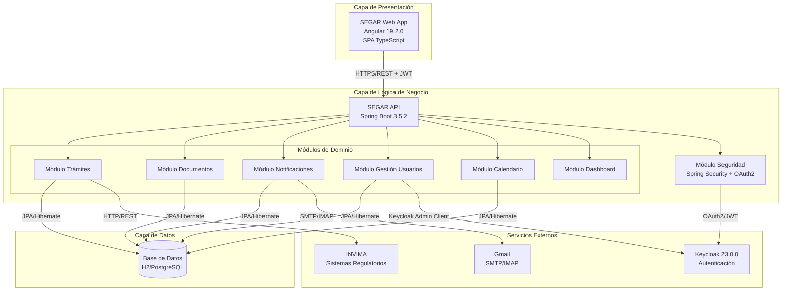

**Tabla 2: Componentes Principales del Sistema**

| Componente | Tecnología | Responsabilidad | Dependencias |
|------------|------------|-----------------|--------------|
| **SEGAR Web App** | Angular 19.2.0 + TypeScript 5.7.2 | Interfaz de usuario, presentación de datos, navegación | SEGAR API, Keycloak JS |
| **SEGAR API** | Spring Boot 3.5.2 + Java 21 | Coordinación de módulos, exposición de APIs REST | Todos los módulos |
| **Módulo Trámites** | Spring Modulith | Gestión del ciclo de vida de trámites regulatorios | Base de Datos, INVIMA |
| **Módulo Documentos** | Spring Modulith + Thymeleaf | Gestión documental y generación de PDFs | Base de Datos |
| **Módulo Notificaciones** | Spring Modulith + Jakarta Mail | Sistema de correo electrónico SMTP/IMAP | Base de Datos, Gmail |
| **Módulo Gestión Usuarios** | Spring Modulith + Keycloak Admin Client | Administración de usuarios y sincronización | Base de Datos, Keycloak |
| **Módulo Calendario** | Spring Modulith | Gestión de eventos y recordatorios | Base de Datos |
| **Módulo Dashboard** | Spring Modulith | Métricas, estadísticas y búsqueda global | Base de Datos |
| **Módulo Seguridad** | Spring Security 6.5.1 + OAuth2 | Autenticación y autorización | Keycloak |
| **Base de Datos** | H2 (dev) / PostgreSQL 15 (prod) | Persistencia de datos | - |
| **Keycloak** | Keycloak 23.0.0 | Servidor de autenticación y autorización | - |
| **Gmail** | Gmail SMTP/IMAP | Servicio de correo electrónico | - |

#### 6.1.2. Descripción Detallada de Módulos

##### Módulo de Trámites

**Figura 2: Diagrama de Componentes - Módulo de Trámites**

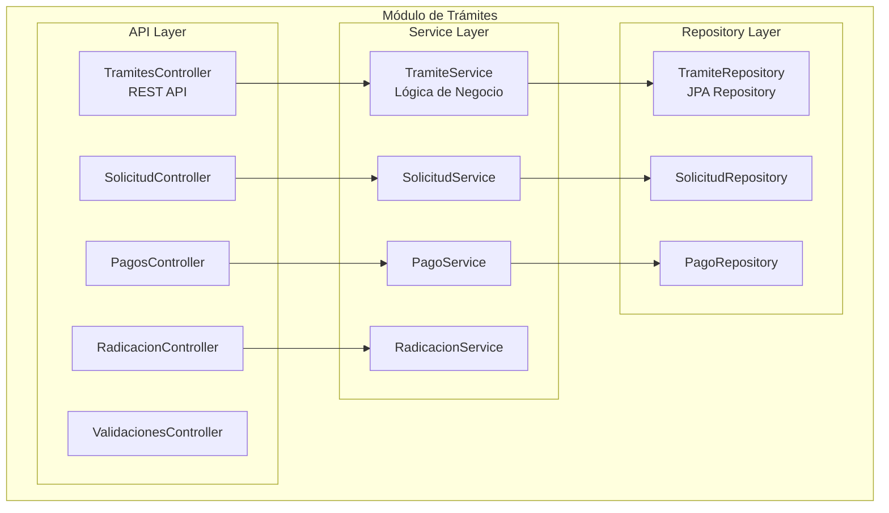

**Responsabilidades**:
- Gestión del ciclo completo de trámites regulatorios
- Proceso de radicación ante INVIMA
- Gestión de solicitudes y documentos asociados
- Control de pagos y validaciones
- Tracking y timeline de eventos del trámite

**Interfaces Proporcionadas**:
- `POST /api/tramites` - Crear nuevo trámite
- `GET /api/tramites/{id}` - Obtener información del trámite
- `GET /api/tramites/{id}/tracking` - Obtener estado de tracking
- `GET /api/tramites/{id}/timeline` - Obtener línea de tiempo
- `POST /api/tramites/{id}/requerimientos/{reqId}/respuesta` - Responder requerimiento

##### Módulo de Notificaciones

**Figura 3: Diagrama de Componentes - Módulo de Notificaciones**

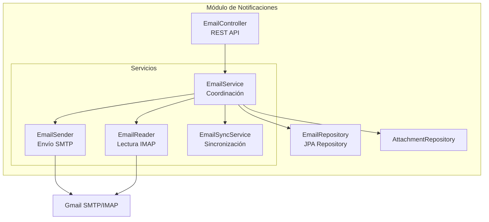

**Responsabilidades**:
- Envío de correos electrónicos vía SMTP
- Recepción de correos vía IMAP
- Sincronización automática y manual
- Gestión de adjuntos
- Filtrado y búsqueda de correos

**Interfaces Proporcionadas**:
- `POST /api/notifications/emails/send` - Enviar correo
- `POST /api/notifications/emails/inbox` - Buscar correos con filtros
- `POST /api/notifications/emails/sync` - Sincronización manual
- `POST /api/notifications/emails/sync-async` - Sincronización asíncrona
- `GET /api/notifications/emails/{id}` - Obtener correo específico

##### Módulo de Gestión de Usuarios

**Figura 4: Diagrama de Componentes - Módulo de Gestión de Usuarios**

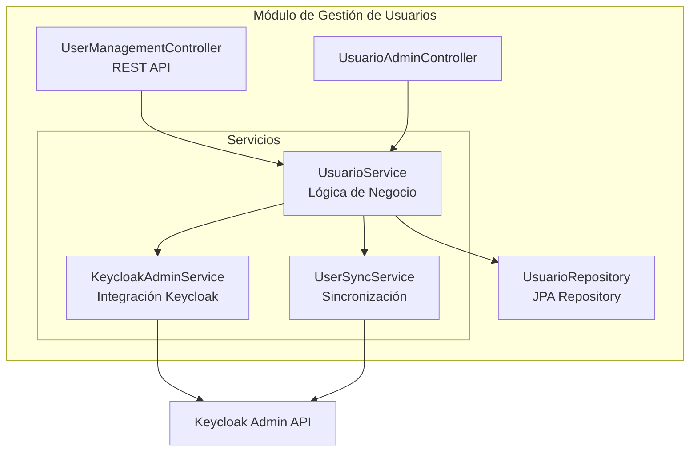

**Responsabilidades**:
- Gestión CRUD de usuarios
- Sincronización bidireccional con Keycloak
- Asignación de roles y permisos
- Gestión de contraseñas
- Activación/desactivación de usuarios

**Interfaces Proporcionadas**:
- `GET /api/usuarios` - Listar y sincronizar usuarios
- `POST /api/usuarios` - Crear usuario (sync con Keycloak)
- `PUT /api/usuarios/{id}` - Actualizar usuario
- `DELETE /api/usuarios/{id}` - Eliminar usuario
- `PATCH /api/usuarios/{id}/toggle-active` - Activar/desactivar
- `PATCH /api/usuarios/{id}/password` - Cambiar contraseña

**Tabla 3: Interfaces entre Componentes**

| Componente Origen | Componente Destino | Protocolo/Tecnología | Propósito |
|-------------------|-------------------|----------------------|-----------|
| SEGAR Web App | SEGAR API | HTTPS/REST + JWT | Comunicación cliente-servidor |
| SEGAR API | Base de Datos | JDBC + JPA/Hibernate | Persistencia de datos |
| Módulo Seguridad | Keycloak | OAuth2 + JWT | Validación de tokens |
| Módulo Notificaciones | Gmail | SMTP (puerto 587) | Envío de correos |
| Módulo Notificaciones | Gmail | IMAP (puerto 993) | Recepción de correos |
| Módulo Usuarios | Keycloak | Keycloak Admin REST API | Gestión de usuarios |
| Módulo Trámites | INVIMA | HTTP/REST | Consulta de normativas |

#### 6.1.3. Patrones Arquitectónicos Utilizados

El sistema implementa los siguientes patrones arquitectónicos:

1. **Arquitectura en Capas (Layered Architecture)**
   - Capa de Presentación (Angular)
   - Capa de Lógica de Negocio (Spring Boot + Modulith)
   - Capa de Datos (JPA/Hibernate + Base de Datos)

2. **Arquitectura Modular (Modular Monolith con Spring Modulith)**
   - Módulos independientes y cohesivos
   - Comunicación entre módulos mediante interfaces bien definidas
   - Facilita evolución independiente de cada módulo

3. **Patrón Repository**
   - Abstracción de acceso a datos
   - Desacoplamiento entre lógica de negocio y persistencia

4. **Patrón Service**
   - Encapsulación de lógica de negocio
   - Coordinación entre múltiples repositorios

5. **Patrón DTO (Data Transfer Object)**
   - Transferencia de datos entre capas
   - Desacoplamiento entre modelo de dominio y representación

6. **Patrón MVC (Model-View-Controller) en Frontend**
   - Separación de responsabilidades
   - Components (View), Services (Controller), Models (Model)

### Descripción

El diagrama de contexto muestra cómo SEGAR interactúa con usuarios y sistemas externos.

```mermaid
graph TB
    %% Usuarios
    Admin[👤 Administrador<br/>Gestiona usuarios y configuración]
    Empleado[👤 Empleado<br/>Gestiona trámites y documentos]
    MIPYME[🏢 MIPYME<br/>Empresa del sector alimentario]
    
    %% Sistema Principal
    SEGAR[🏛️ SEGAR<br/>Sistema de Gestión de<br/>Trámites Regulatorios<br/><br/>Automatiza la gestión de<br/>trámites regulatorios para<br/>el sector de alimentos<br/>procesados en Colombia]
    
    %% Sistemas Externos
    INVIMA[🏛️ INVIMA<br/>Instituto Nacional de<br/>Vigilancia de Medicamentos<br/>y Alimentos<br/><br/>Entidad reguladora<br/>colombiana]
    Gmail[📧 Gmail SMTP/IMAP<br/>Servicio de correo<br/>electrónico<br/><br/>Envío y recepción<br/>de notificaciones]
    Keycloak[🔐 Keycloak<br/>Servidor de autenticación<br/>y autorización<br/><br/>Gestión de usuarios<br/>y roles]
    
    %% Relaciones
    Admin -->|"Gestiona usuarios<br/>y configuración"| SEGAR
    Empleado -->|"Crea y gestiona<br/>trámites regulatorios"| SEGAR
    MIPYME -->|"Solicita registros<br/>sanitarios"| SEGAR
    
    SEGAR -->|"Consulta normativas<br/>y procesos"| INVIMA
    SEGAR -->|"Envía notificaciones<br/>y recibe correos"| Gmail
    SEGAR -->|"Autentica usuarios<br/>y valida permisos"| Keycloak
    
    %% Estilos
### 6.2 Vista Física del Sistema

La vista física describe cómo los componentes del sistema están desplegados en la infraestructura física o virtual. Se presentan dos configuraciones: desarrollo (local) y producción (propuesta).

#### 6.2.1 Diagrama de Despliegue - Entorno de Desarrollo

**Figura 5**: Diagrama de Despliegue - Desarrollo

```mermaid
graph TB
    subgraph "Máquina de Desarrollo (localhost)"
        subgraph "Navegador Web"
            Angular[🌐 Angular App<br/>:4200]
        end
        
        subgraph "Servidor de Aplicaciones"
            SpringBoot[⚙️ Spring Boot API<br/>:8090]
        end
        
        subgraph "Servidor de Autenticación"
            Keycloak[🔐 Keycloak Server<br/>:8080]
        end
        
        subgraph "Base de Datos"
            H2DB[(🗄️ H2 Database<br/>modo embedded)]
        end
        
        subgraph "Sistema de Archivos Local"
            FileSystem[📁 Sistema de Archivos<br/>~/segar/uploads]
        end
    end
    
    subgraph "Servicios Externos"
        Gmail[📧 Gmail SMTP/IMAP<br/>smtp.gmail.com:587<br/>imap.gmail.com:993]
    end
    
    Angular -->|HTTPS GET/POST| SpringBoot
    Angular -->|OAuth2 Login| Keycloak
    SpringBoot -->|JWT Validation| Keycloak
    SpringBoot -->|JDBC| H2DB
    SpringBoot -->|File I/O| FileSystem
    SpringBoot -->|SMTP/IMAP| Gmail
    
    classDef frontendNode fill:#e8f5e8,stroke:#2e7d32,stroke-width:2px
    classDef backendNode fill:#fff3e0,stroke:#f57c00,stroke-width:2px
    classDef authNode fill:#e3f2fd,stroke:#1976d2,stroke-width:2px
    classDef dataNode fill:#fce4ec,stroke:#c2185b,stroke-width:2px
    classDef externalNode fill:#f3e5f5,stroke:#7b1fa2,stroke-width:2px
    
    class Angular frontendNode
    class SpringBoot backendNode
    class Keycloak authNode
    class H2DB,FileSystem dataNode
    class Gmail externalNode
```

**Tabla 4**: Nodos de Despliegue - Entorno de Desarrollo

| Nodo | Tecnología | Puerto | Responsabilidad | Recursos Requeridos |
|------|------------|--------|----------------|---------------------|
| Angular App | Node.js 20 + npm | 4200 | Servir interfaz de usuario SPA | 512 MB RAM, 100 MB disco |
| Spring Boot API | Java 21 + Spring Boot 3.5.2 | 8090 | API REST, lógica de negocio | 1 GB RAM, 500 MB disco |
| Keycloak Server | Keycloak 23.0.0 | 8080 | Autenticación y autorización | 1 GB RAM, 500 MB disco |
| H2 Database | H2 Database Engine | embedded | Almacenamiento de datos | 512 MB RAM, 200 MB disco |
| Sistema de Archivos | File System local | N/A | Almacenamiento de documentos | 2 GB disco disponible |
| Gmail SMTP/IMAP | Servicio externo | 587/993 | Envío y recepción de correos | N/A |

#### 6.2.2 Diagrama de Despliegue - Entorno de Producción (Propuesta)

**Figura 6**: Diagrama de Despliegue - Producción

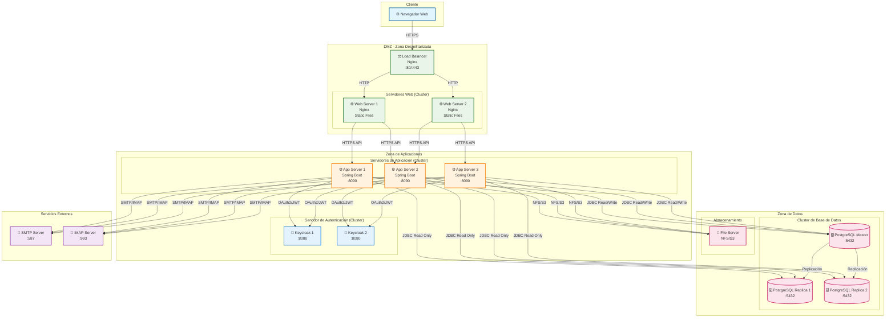

**Tabla 5**: Nodos de Despliegue - Entorno de Producción

| Nodo | Tecnología | Cantidad | Responsabilidad | Recursos Requeridos |
|------|------------|----------|----------------|---------------------|
| Load Balancer | Nginx + SSL/TLS | 1 (HA) | Balanceo de carga, terminación SSL | 2 GB RAM, 2 vCPU |
| Web Server | Nginx | 2+ | Servir archivos estáticos Angular | 1 GB RAM, 1 vCPU cada uno |
| App Server | Spring Boot 3.5.2 | 3+ | Procesamiento de lógica de negocio | 4 GB RAM, 2 vCPU cada uno |
| Keycloak Server | Keycloak 23.0.0 (cluster) | 2+ | Autenticación/autorización | 2 GB RAM, 2 vCPU cada uno |
| PostgreSQL Master | PostgreSQL 15 | 1 | Base de datos principal (R/W) | 8 GB RAM, 4 vCPU, 100 GB SSD |
| PostgreSQL Replica | PostgreSQL 15 | 2 | Réplicas de lectura | 4 GB RAM, 2 vCPU, 100 GB SSD cada uno |
| File Server | NFS/AWS S3 | 1 | Almacenamiento de documentos | 500 GB almacenamiento escalable |
| SMTP/IMAP Server | Servidor corporativo | 1 | Correo electrónico | N/A (servicio externo) |

#### 6.2.3 Consideraciones de Infraestructura

**Alta Disponibilidad (HA)**:
- Load Balancer con failover automático
- Cluster de aplicaciones con mínimo 3 nodos
- Cluster de Keycloak con sesiones compartidas
- Replicación de base de datos Master-Replica

**Escalabilidad**:
- Horizontal: Agregar más nodos de aplicación según demanda
- Vertical: Incrementar recursos en nodos existentes
- Escalado automático basado en métricas (CPU > 70%, RAM > 80%)

**Seguridad de Red**:
- DMZ para servidores web expuestos a Internet
- Zona de aplicaciones en red privada
- Zona de datos aislada con acceso restringido
- Firewall entre zonas con reglas estrictas
- SSL/TLS en todas las comunicaciones externas

**Backup y Recuperación**:
- Backups diarios de PostgreSQL (full + incremental)
- Réplicas de lectura como backup en caliente
- Almacenamiento de backups en ubicación geográfica diferente
- RTO (Recovery Time Objective): 1 hora
- RPO (Recovery Point Objective): 15 minutos

---

### 6.3 Vista de Procesos del Sistema

La vista de procesos describe los procesos de negocio principales y cómo fluyen las interacciones a través de los componentes del sistema.

#### 6.3.1 Proceso de Creación de Trámite

**Figura 7**: Diagrama de Actividades - Creación de Trámite

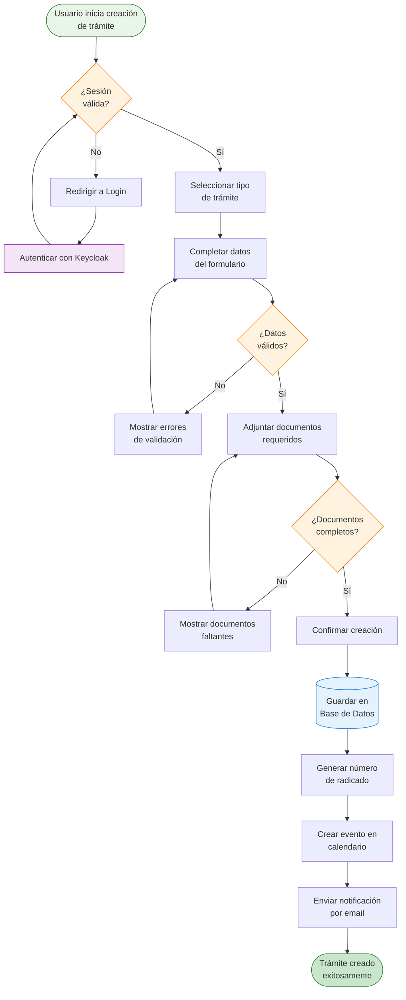

**Descripción del Proceso**:

1. **Inicio de Sesión**: Usuario debe autenticarse con Keycloak antes de crear trámite
2. **Selección de Tipo**: Sistema presenta tipos de trámite disponibles (Registro Sanitario, Modificación, Renovación, etc.)
3. **Captura de Datos**: Usuario completa formulario con validación en tiempo real (frontend) y validación final (backend)
4. **Adjunción de Documentos**: Sistema valida tipos MIME, tamaño y completitud de documentos requeridos
5. **Almacenamiento**: Transacción que guarda trámite, documentos y genera número de radicado único
6. **Notificación**: Sistema envía email de confirmación y crea evento en calendario
7. **Finalización**: Usuario recibe número de radicado para seguimiento

**Componentes Involucrados**:
- `TramitesController`: Recibe petición HTTP POST
- `TramiteService`: Ejecuta lógica de negocio y validaciones
- `DocumentService`: Procesa y almacena documentos
- `CalendarioService`: Crea evento de seguimiento
- `EmailService`: Envía notificación por correo
- `TramiteRepository`: Persiste datos en PostgreSQL

#### 6.3.2 Proceso de Radicación de Documentos

**Figura 8**: Diagrama de Actividades - Radicación

```mermaid
flowchart TD
    Start([Empleado recibe<br/>solicitud física]) --> VerificarDocumentos[Verificar documentos<br/>presentados]
    
    VerificarDocumentos --> DocumentosCompletos{¿Documentos<br/>completos?}
    
    DocumentosCompletos -->|No| GenerarRequerimiento[Generar requerimiento<br/>de subsanación]
    GenerarRequerimiento --> NotificarRequerimiento[Notificar a MIPYME<br/>vía email]
    NotificarRequerimiento --> EsperarSubsanacion[Esperar subsanación]
    EsperarSubsanacion --> VerificarDocumentos
    
    DocumentosCompletos -->|Sí| DigitalizarDocs[Digitalizar documentos<br/>físicos]
    DigitalizarDocs --> CargarSistema[Cargar documentos<br/>al sistema]
    
    CargarSistema --> AsignarRadicado[Asignar número<br/>de radicado único]
    AsignarRadicado --> GuardarBD[(Guardar radicación<br/>en BD)]
    
    GuardarBD --> ActualizarEstado[Actualizar estado<br/>trámite a "Radicado"]
    ActualizarEstado --> CrearEventoSeguimiento[Crear evento de<br/>seguimiento]
    
    CrearEventoSeguimiento --> EnviarConfirmacion[Enviar confirmación<br/>a MIPYME]
    EnviarConfirmacion --> GenerarCertificado[Generar certificado<br/>de radicación PDF]
    
    GenerarCertificado --> End([Radicación<br/>completada])
    
    style Start fill:#e8f5e8,stroke:#2e7d32
    style End fill:#c8e6c9,stroke:#2e7d32
    style DocumentosCompletos fill:#fff3e0,stroke:#f57c00
    style GuardarBD fill:#e3f2fd,stroke:#1976d2
```

**Descripción del Proceso**:

1. **Verificación Inicial**: Empleado revisa completitud de documentación física
2. **Gestión de Requerimientos**: Si faltan documentos, se genera requerimiento de subsanación automático
3. **Digitalización**: Documentos físicos son escaneados y cargados al sistema
4. **Asignación de Radicado**: Sistema genera número único secuencial con formato `RAD-YYYY-NNNNNN`
5. **Persistencia**: Transacción que almacena radicación y actualiza estado del trámite
6. **Notificación**: MIPYME recibe email con certificado de radicación en PDF
7. **Seguimiento**: Evento creado en calendario para monitorear plazos legales

**Componentes Involucrados**:
- `RadicacionController`: API REST para radicación
- `SolicitudService`: Gestiona lógica de radicación
- `DocumentService`: Almacena documentos digitalizados
- `PDFService`: Genera certificado de radicación
- `EmailService`: Envía notificaciones
- `CalendarioService`: Programa seguimientos

#### 6.3.3 Proceso de Sincronización de Correos

**Figura 9**: Diagrama de Actividades - Sincronización de Correos

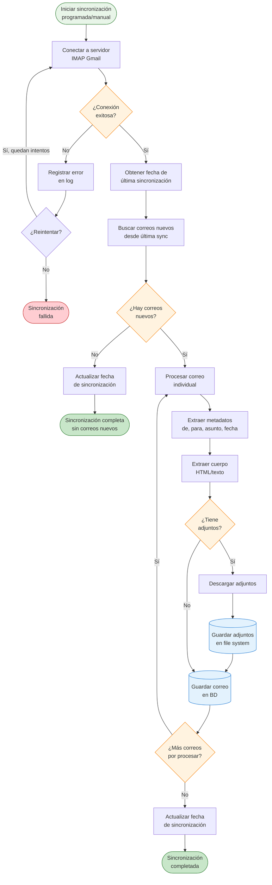

**Descripción del Proceso**:

1. **Activación**: Proceso ejecutado cada 10 minutos (automático) o bajo demanda (manual)
2. **Conexión IMAP**: Establece conexión segura con Gmail (puerto 993, SSL/TLS)
3. **Manejo de Errores**: Sistema reintenta hasta 3 veces con backoff exponencial
4. **Búsqueda Incremental**: Solo descarga correos posteriores a última sincronización exitosa
5. **Procesamiento Individual**: Cada correo se procesa en transacción independiente
6. **Gestión de Adjuntos**: Adjuntos se descargan, validan y almacenan en file system con referencia en BD
7. **Actualización de Estado**: Marca correos como sincronizados para evitar duplicados

**Componentes Involucrados**:
- `EmailSyncScheduler`: Tarea programada con `@Scheduled`
- `EmailReaderService`: Implementación IMAP con JavaMail API
- `EmailService`: Orquesta sincronización y almacenamiento
- `EmailRepository`: Persiste correos en PostgreSQL
- `AttachmentRepository`: Persiste metadatos de adjuntos

**Consideraciones de Rendimiento**:
- Procesamiento asíncrono con `@Async`
- Paginación de correos (50 por lote)
- Pool de conexiones IMAP (máximo 5 concurrentes)
- Timeout de conexión: 30 segundos

---

## 7. Diseño Detallado del Sistema

Esta sección describe el diseño a nivel de código, incluyendo diagramas de clases, diagramas de secuencia, modelo de datos y diseño de interfaz de usuario.

---

### 7.1 Estructura del Sistema

#### 7.1.1 Diagrama de Clases - Módulo de Trámites

**Figura 10**: Diagrama de Clases - Módulo de Trámites

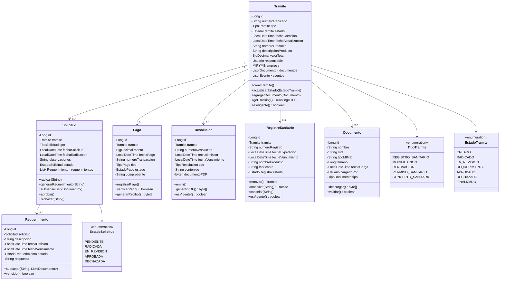

**Tabla 6**: Descripción de Clases Principales - Módulo de Trámites

| Clase | Responsabilidad | Métodos Clave |
|-------|----------------|---------------|
| `Tramite` | Representa un trámite regulatorio completo | `crearTramite()`, `actualizarEstado()`, `getTracking()` |
| `Solicitud` | Gestiona solicitudes y radicación | `radicar()`, `generarRequerimiento()`, `aprobar()` |
| `Pago` | Administra pagos de trámites | `registrarPago()`, `verificarPago()`, `generarRecibo()` |
| `Resolucion` | Representa resoluciones emitidas | `emitir()`, `generarPDF()`, `esVigente()` |
| `RegistroSanitario` | Gestiona registros sanitarios | `renovar()`, `modificar()`, `cancelar()` |
| `Documento` | Almacena documentos adjuntos | `descargar()`, `validar()` |
| `Requerimiento` | Gestiona requerimientos de subsanación | `subsanar()`, `vencido()` |

---

### 7.2 Comportamiento del Sistema

Los diagramas de secuencia describen cómo interactúan los objetos del sistema en escenarios específicos.

#### 7.2.1 Diagrama de Secuencia - Creación de Trámite

**Figura 11**: Diagrama de Secuencia - Creación de Trámite

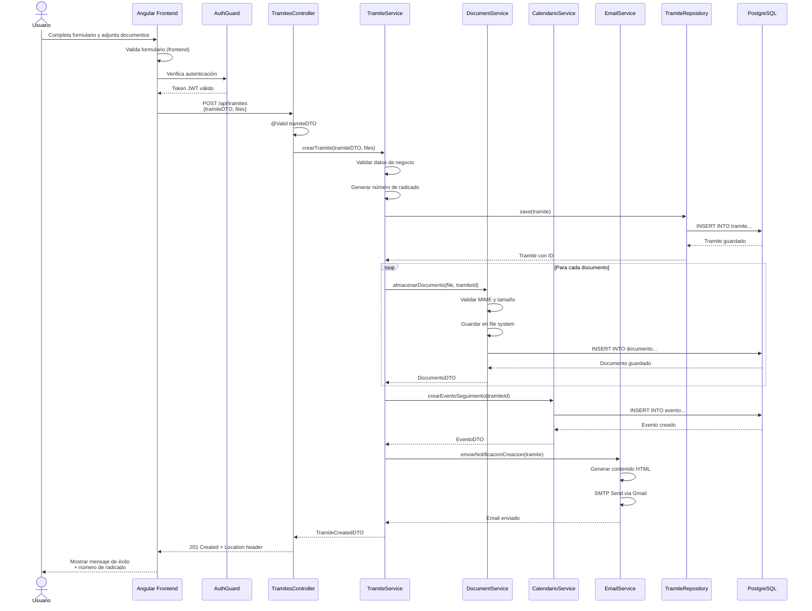

**Flujo de Ejecución**:

1. **Validación Frontend**: Angular valida formulario antes de enviar
2. **Autenticación**: AuthGuard verifica JWT antes de permitir petición
3. **Validación Backend**: `@Valid` valida DTO según constraints
4. **Generación de Radicado**: Formato `RAD-YYYY-NNNNNN` secuencial
5. **Transacción de Persistencia**: Tramite guardado con `@Transactional`
6. **Procesamiento de Documentos**: Loop que valida y almacena cada archivo
7. **Creación de Evento**: Evento de seguimiento en calendario
8. **Notificación Email**: Correo enviado de forma asíncrona con `@Async`
9. **Respuesta HTTP**: 201 Created con header `Location: /api/tramites/{id}`

---

### 7.3 Persistencia del Sistema

#### 7.3.1 Modelo Entidad-Relación (ER)

**Figura 12**: Diagrama Entidad-Relación Simplificado

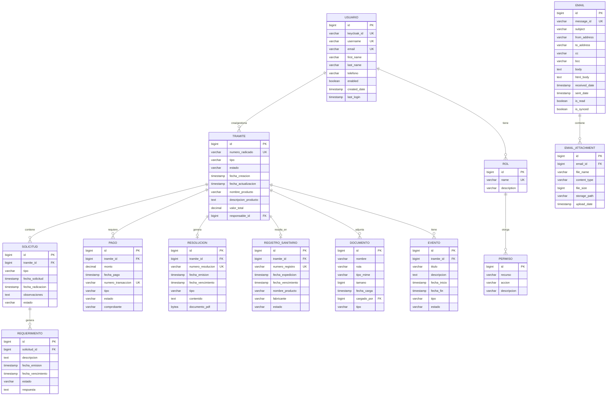

**Tabla 9**: Entidades Principales del Sistema

| Entidad | Propósito | Relaciones Clave |
|---------|-----------|-----------------|
| `USUARIO` | Almacena información de usuarios del sistema | Relacionado con TRAMITE (1:N), ROL (N:M) |
| `TRAMITE` | Entidad principal que agrupa todo el proceso regulatorio | Hub central relacionado con SOLICITUD, PAGO, RESOLUCION, etc. |
| `SOLICITUD` | Registra solicitudes formales de trámites | Relacionado con TRAMITE (N:1), REQUERIMIENTO (1:N) |
| `PAGO` | Registra pagos realizados para trámites | Relacionado con TRAMITE (N:1) |
| `RESOLUCION` | Almacena resoluciones oficiales emitidas | Relacionado con TRAMITE (1:1 opcional) |
| `REGISTRO_SANITARIO` | Registros sanitarios vigentes y vencidos | Relacionado con TRAMITE (1:1 opcional) |
| `DOCUMENTO` | Almacena metadatos de archivos adjuntos | Relacionado con TRAMITE (N:1) |
| `EVENTO` | Eventos de calendario para seguimiento | Relacionado con TRAMITE (N:1) |
| `EMAIL` | Correos electrónicos sincronizados | Relacionado con EMAIL_ATTACHMENT (1:N) |
| `ROL` | Roles de usuario (ADMIN, EMPLEADO, MIPYME) | Relacionado con USUARIO (N:M), PERMISO (N:M) |

#### 7.3.2 Estrategias de Persistencia

**Tecnologías Utilizadas**:
- **ORM**: JPA 3.1.0 con Hibernate 6.2.x
- **Base de Datos**: H2 (desarrollo), PostgreSQL 15 (producción)
- **Pool de Conexiones**: HikariCP (configuración optimizada)
- **Migraciones**: Flyway (control de versiones de esquema)

**Índices Optimizados**:
```sql
-- Índices para búsquedas frecuentes
CREATE INDEX idx_tramite_numero_radicado ON tramite(numero_radicado);
CREATE INDEX idx_tramite_estado ON tramite(estado);
CREATE INDEX idx_tramite_fecha_creacion ON tramite(fecha_creacion DESC);
CREATE INDEX idx_email_message_id ON email(message_id);
CREATE INDEX idx_email_is_read ON email(is_read) WHERE is_read = false;
CREATE INDEX idx_usuario_keycloak_id ON usuario(keycloak_id);
```

**Consultas Optimizadas**:
- Uso de `@EntityGraph` para evitar N+1 queries
- Paginación con `Pageable` en repositorios
- Proyecciones DTO para consultas de solo lectura
- Consultas nativas SQL para agregaciones complejas

---

### 7.4 Interfaz de Usuario

#### 7.4.1 Diagrama de Navegación - Frontend Angular

**Figura 13**: Diagrama de Navegación Principal

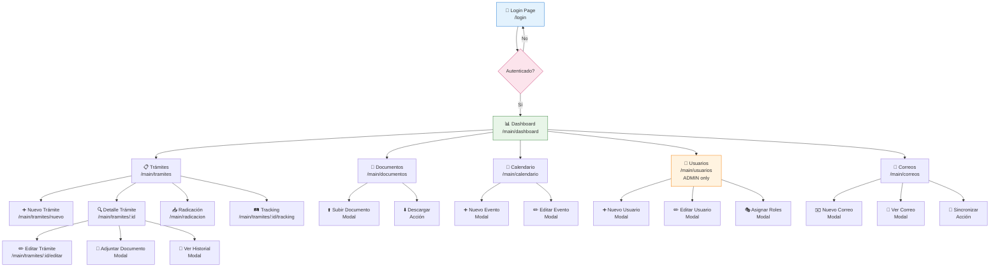

**Tabla 10**: Descripción de Pantallas Principales

| Pantalla | Ruta | Componentes | Protección | Descripción |
|----------|------|------------|-----------|-------------|
| **Login** | `/login` | `LoginFormComponent`, `AuthPageComponent` | Pública | Autenticación con Keycloak |
| **Dashboard** | `/main/dashboard` | `DashboardComponent`, `StatsCardComponent` | `AuthGuard` | Panel principal con métricas |
| **Trámites** | `/main/tramites` | `TramitesListComponent`, `TramiteCardComponent` | `AuthGuard` | Lista y gestión de trámites |
| **Nuevo Trámite** | `/main/tramites/nuevo` | `TramiteFormComponent`, `FileUploadComponent` | `AuthGuard` | Crear nuevo trámite |
| **Detalle Trámite** | `/main/tramites/:id` | `TramiteDetailComponent`, `TimelineComponent` | `AuthGuard` | Ver detalles completos |
| **Radicación** | `/main/radicacion` | `RadicacionComponent`, `SolicitudListComponent` | `AuthGuard + RoleGuard(EMPLEADO)` | Radicar solicitudes |
| **Documentos** | `/main/documentos` | `DocumentosListComponent`, `DocumentViewerComponent` | `AuthGuard` | Gestión de documentos |
| **Calendario** | `/main/calendario` | `CalendarioComponent`, `EventoModalComponent` | `AuthGuard` | Calendario de eventos |
| **Usuarios** | `/main/usuarios` | `UsuariosListComponent`, `UsuarioFormComponent` | `AuthGuard + RoleGuard(ADMIN)` | Gestión de usuarios (solo admin) |
| **Correos** | `/main/correos` | `EmailListComponent`, `EmailViewerComponent` | `AuthGuard` | Bandeja de correos |

#### 7.4.2 Patrones de UI Implementados

**1. Atomic Design**:
- **Atoms**: Botones, inputs, labels, iconos
- **Molecules**: FormFields, SearchBars, Cards
- **Organisms**: Navbar, Sidebar, DataTables
- **Templates**: MainLayout, AuthLayout
- **Pages**: DashboardPage, TramitesPage

**2. Responsive Design**:
- Breakpoints: Mobile (<768px), Tablet (768-1024px), Desktop (>1024px)
- Grid System: CSS Grid + Flexbox
- Mobile-first approach

**3. Componentes Reutilizables**:
```typescript
// Ejemplo: GenericTableComponent
@Component({
  selector: 'app-generic-table',
  templateUrl: './generic-table.component.html'
})
export class GenericTableComponent<T> {
  @Input() data: T[] = [];
  @Input() columns: TableColumn[] = [];
  @Input() actions: TableAction[] = [];
  @Output() actionClick = new EventEmitter<{action: string, row: T}>();
}
```

**4. Gestión de Estado**:
- Services con BehaviorSubject para estado compartido
- LocalStorage para persistencia de preferencias
- SessionStorage para datos de sesión temporal

---

## 8. Referencias

### 8.1 Normas y Estándares

1. **IEEE Std 1016-2009**: IEEE Standard for Information Technology - Systems Design - Software Design Descriptions. IEEE Computer Society, 2009.

2. **ISO/IEC/IEEE 42010:2011**: Systems and software engineering - Architecture description. International Organization for Standardization, 2011.

3. **Kruchten, Philippe**: "The 4+1 View Model of Architecture". IEEE Software, vol. 12, no. 6, pp. 42-50, November 1995.

4. **Bass, Len; Clements, Paul; Kazman, Rick**: "Software Architecture in Practice", 3rd Edition. Addison-Wesley Professional, 2012.

### 8.2 Tecnologías y Frameworks

5. **Spring Boot Documentation**: Spring Boot Reference Guide 3.5.2. Pivotal Software, Inc., 2025. [https://docs.spring.io/spring-boot/docs/3.5.2/reference/html/](https://docs.spring.io/spring-boot/docs/3.5.2/reference/html/)

6. **Spring Modulith Documentation**: Spring Modulith Reference Documentation 1.1.4. VMware, Inc., 2025. [https://docs.spring.io/spring-modulith/reference/](https://docs.spring.io/spring-modulith/reference/)

7. **Angular Documentation**: Angular Framework Documentation v19.2.0. Google LLC, 2025. [https://angular.dev/](https://angular.dev/)

8. **Keycloak Documentation**: Keycloak Server Administration Guide 23.0.0. Red Hat, Inc., 2024. [https://www.keycloak.org/docs/23.0.0/](https://www.keycloak.org/docs/23.0.0/)

9. **PostgreSQL Documentation**: PostgreSQL 15 Documentation. PostgreSQL Global Development Group, 2024. [https://www.postgresql.org/docs/15/](https://www.postgresql.org/docs/15/)

### 8.3 Patrones de Diseño

10. **Fowler, Martin**: "Patterns of Enterprise Application Architecture". Addison-Wesley Professional, 2002.

11. **Evans, Eric**: "Domain-Driven Design: Tackling Complexity in the Heart of Software". Addison-Wesley Professional, 2003.

12. **Newman, Sam**: "Building Microservices: Designing Fine-Grained Systems", 2nd Edition. O'Reilly Media, 2021.

### 8.4 Seguridad

13. **OWASP Top 10**: OWASP Top 10 Web Application Security Risks 2021. Open Web Application Security Project, 2021. [https://owasp.org/www-project-top-ten/](https://owasp.org/www-project-top-ten/)

14. **RFC 7519**: JSON Web Token (JWT). Internet Engineering Task Force (IETF), 2015. [https://tools.ietf.org/html/rfc7519](https://tools.ietf.org/html/rfc7519)

15. **RFC 6749**: The OAuth 2.0 Authorization Framework. Internet Engineering Task Force (IETF), 2012. [https://tools.ietf.org/html/rfc6749](https://tools.ietf.org/html/rfc6749)

### 8.5 Arquitectura de Software

16. **C4 Model**: Simon Brown. "The C4 model for visualising software architecture". [https://c4model.com/](https://c4model.com/)

17. **Hexagonal Architecture**: Alistair Cockburn. "Hexagonal Architecture (Ports and Adapters)". 2005.

18. **Clean Architecture**: Robert C. Martin. "Clean Architecture: A Craftsman's Guide to Software Structure and Design". Prentice Hall, 2017.

---

## 9. Anexos

### Anexo A: Glosario de Términos

| Término | Definición |
|---------|-----------|
| **MIPYME** | Micro, Pequeña y Mediana Empresa del sector de alimentos procesados |
| **INVIMA** | Instituto Nacional de Vigilancia de Medicamentos y Alimentos de Colombia |
| **Registro Sanitario** | Documento expedido por INVIMA que autoriza la comercialización de un alimento procesado |
| **Radicación** | Proceso de asignación de número único a una solicitud formal |
| **Requerimiento** | Solicitud oficial de subsanación de documentos o información |
| **Trámite** | Proceso regulatorio completo desde solicitud hasta resolución |
| **JWT** | JSON Web Token - estándar de token de autenticación |
| **OAuth2** | Protocolo de autorización estándar de la industria |
| **SMTP** | Simple Mail Transfer Protocol - protocolo de envío de correos |
| **IMAP** | Internet Message Access Protocol - protocolo de lectura de correos |

### Anexo B: Acrónimos

| Acrónimo | Significado |
|----------|------------|
| **API** | Application Programming Interface |
| **DTO** | Data Transfer Object |
| **JPA** | Java Persistence API |
| **ORM** | Object-Relational Mapping |
| **REST** | Representational State Transfer |
| **CRUD** | Create, Read, Update, Delete |
| **SPA** | Single Page Application |
| **SSL/TLS** | Secure Sockets Layer / Transport Layer Security |
| **HA** | High Availability |
| **RTO** | Recovery Time Objective |
| **RPO** | Recovery Point Objective |

### Anexo C: Historial de Actualizaciones del Sistema

| Versión | Fecha | Cambios Principales |
|---------|-------|---------------------|
| **1.0.0** | Sept 2025 | Versión inicial con módulos de trámites, documentos y calendario |
| **1.1.0** | Oct 2025 | Integración con Keycloak para autenticación |
| **1.2.0** | Nov 2025 | Sistema de notificaciones con SMTP/IMAP, gestión de usuarios mejorada, dashboard con búsqueda global |

---

## 10. Conclusiones

### 10.1 Cumplimiento de Requisitos

El diseño arquitectónico de SEGAR cumple con los siguientes requisitos clave:

✅ **Modularidad**: Arquitectura basada en Spring Modulith con separación clara de responsabilidades  
✅ **Escalabilidad**: Diseño preparado para escalado horizontal y vertical  
✅ **Seguridad**: Autenticación robusta con Keycloak y autorización basada en roles  
✅ **Mantenibilidad**: Patrones de diseño establecidos y código bien estructurado  
✅ **Extensibilidad**: Fácil agregado de nuevos módulos sin afectar existentes  
✅ **Resiliencia**: Manejo de errores y recuperación ante fallos  
✅ **Rendimiento**: Optimizaciones en consultas y procesamiento asíncrono

### 10.2 Evolución Reciente

La implementación actual representa una base sólida con las siguientes mejoras:

- **Sistema de Notificaciones Completo**: SMTP/IMAP con sincronización automática cada 10 minutos
- **Gestión Avanzada de Usuarios**: Integración bidireccional con Keycloak
- **Dashboard Mejorado**: Búsqueda global transversal y métricas en tiempo real
- **Documentos Dinámicos**: Generación de PDFs con plantillas Thymeleaf
- **Autenticación Robusta**: OAuth2/JWT con Resource Owner Password Flow

### 10.3 Recomendaciones Futuras

Para continuar la evolución del sistema, se recomienda:

1. **Arquitectura Basada en Eventos**: Implementar Event-Driven Architecture con Spring Events para comunicación asíncrona entre módulos
2. **Capa de Caché**: Añadir Redis para mejorar rendimiento en consultas frecuentes
3. **API Gateway**: Implementar Spring Cloud Gateway para gestión centralizada de APIs
4. **Observabilidad**: Integrar OpenTelemetry, Micrometer y logs estructurados
5. **Circuit Breaker**: Implementar Resilience4j para integraciones externas (INVIMA, Gmail)
6. **Containerización**: Dockerizar aplicación para despliegue en Kubernetes
7. **CI/CD**: Implementar pipelines automatizados con GitHub Actions o GitLab CI

---

**Documento de Arquitectura de Software del Sistema SEGAR**  
**Fecha de elaboración**: Noviembre 11, 2025  
**Versión del documento**: 2.0 (IEEE 1016-2009 compliant)  
**Versión del sistema**: 1.2.0  
**Autor**: Equipo de Desarrollo SEGAR  

---
